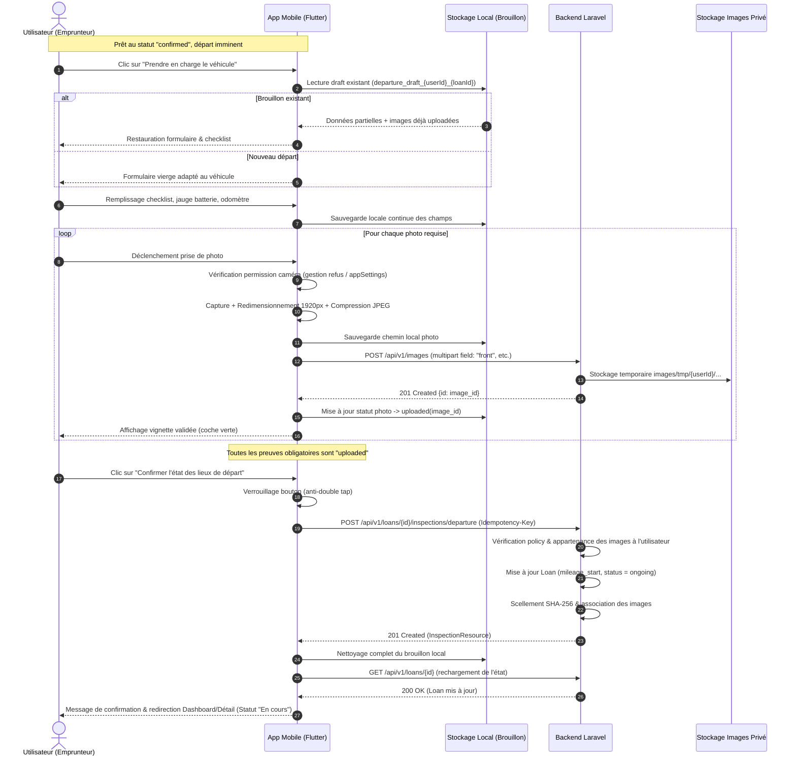

# Spécification Technique & Cadrage — Lot 10 (Prise en charge et état des lieux départ)

Ce document formalise l'architecture, la matrice d'accès, la gestion des preuves photographiques scellées, le stockage et la reprise des brouillons locaux, la gestion de la caméra, ainsi que les contrats d'API et la stratégie de test pour le **Lot 10** du projet LocoMotion.

---

## 1. Mission & Périmètre du Lot 10

### 1.1 Mission
Permettre un relevé fiable, contradictoire et sécurisé de la prise en charge du véhicule au départ du prêt, avec constitution d'un dossier de preuves photographiques infalsifiable, accessible exclusivement aux participants autorisés (emprunteur, propriétaire, administrateur), tout en garantissant une expérience fluide sur smartphone (reprise d'upload, mode brouillon, gestion fine des permissions).

### 1.2 Périmètre inclus
1. **Entrée « Prendre en charge » conditionnelle** :
   - Présente dans [`LoanDetailScreen`](file:///Users/fabapps/Documents/Dev/locomotion/mobile/lib/features/loans/presentation/screens/loan_detail_screen.dart).
   - Conditionnée par le rôle de l'utilisateur (emprunteur du prêt ou propriétaire/co-propriétaire en cas de prise en charge conjointe, admin).
   - Conditionnée par le statut du prêt : `confirmed` (prépaiement et caution validés au Lot 9) ou `ongoing` (si le prêt a débuté mais que l'inspection départ n'est pas encore enregistrée).
   - Conditionnée par la fenêtre temporelle de prise en charge (accessible à partir de 1h avant `departure_at`).
   - Si caution/prépaiement requis et non finalisé : affichage prioritaire du bouton de prépaiement (Lot 9) avec blocage de la prise en charge.

2. **Parcours Guidé & Checklist de Départ** :
   - Écran dédié [`loan_departure_inspection_screen.dart`](file:///Users/fabapps/Documents/Dev/locomotion/mobile/lib/features/loans/presentation/screens/loan_departure_inspection_screen.dart).
   - Présentation des consignes de récupération du véhicule (emplacement, boîte à clés, instructions spécifiques).
   - Checklist interactive adaptée :
     - **Véhicule motorisé (voiture)** : présence de la clé physique, documents d'assurance à bord, câble de recharge (si électrique), roue de secours / kit de gonflage.
     - **Véhicule sans moteur (vélo, remorque)** : présence de l'antivol, clé d'antivol fonctionnelle, accessoires / casque.
   - Saisie du compteur kilométrique (`odometer_km`) : entier strict positif avec unité explicite ("KM"). Masqué et optionnel pour les véhicules sans compteur (`requires_mileage == false`).
   - Jauge batterie / carburant (`fuel_battery_level_percent`) : curseur de 0 à 100 %.
   - Évaluation de l'état de propreté intérieur/extérieur (1 à 5).
   - Notes libres pour signaler des micro-dégradations préexistantes (`existing_damages_notes`).

3. **Capture Photos & Gestion Caméra** :
   - Grille de photos obligatoires et optionnelles :
     - `dashboard_odometer` (obligatoire pour véhicule motorisé).
     - `front` (face avant, obligatoire).
     - `back` (face arrière, obligatoire).
     - `left_side` (côté gauche, obligatoire).
     - `right_side` (côté droit, obligatoire).
     - Photos optionnelles pour dommages constatés (`damage_1`, `damage_2`).
   - Intégration de la prise de vue (caméra ou galerie).
   - Gestion rigoureuse des permissions caméra :
     - Message explicatif pédagogique avant demande de permission.
     - Traitement du refus simple (`denied`) avec invitation à réessayer.
     - Traitement du refus définitif (`permanentlyDenied`) avec guidage vers les paramètres système de l'appareil (`openAppSettings`).
   - Préparation des images : redimensionnement (max 1920px), compression JPEG (qualité 80-85%) et redressement EXIF avant téléversement.

4. **Brouillon Local & Reprise Asynchrone des Uploads** :
   - Sauvegarde locale automatique (`departure_draft_{userId}_{loanId}`).
   - Téléversement individuel des photos dès la capture vers `POST /api/v1/images`.
   - Reprise résiliente : en cas de fermeture de l'application ou de coupure réseau, les photos ayant déjà obtenu un `image_id` serveur ne sont jamais re-téléversées.
   - Aucun envoi automatique silencieux hors-ligne : la confirmation finale requiert une action explicite en ligne de l'utilisateur.

5. **Socle Serveur & Contrats d'Inspection** :
   - Endpoint `POST /api/v1/loans/{loan}/inspections/departure` :
     - Vérification de la policy `LoanPolicy@updateLoanInfo`.
     - Contrôle strict anti-IDOR : vérification que chaque `image_id` soumis appartient bien à l'utilisateur courant (`images/tmp/{userId}/...`). Tout identifiant étranger déclenche un `403 Forbidden`.
     - Scellement cryptographique SHA-256 de l'état des lieux.
     - Mise à jour atomique du statut du prêt vers `ongoing` et initialisation de `mileage_start`.
   - Endpoint `GET /api/v1/loans/{loan}/inspections` : consultation du dossier scellé réservée aux parties prenantes (`LoanPolicy@view`).
   - Mise à niveau d'`ImagePolicy` : autorisation de consultation des photos d'inspection pour l'emprunteur, les co-propriétaires et les administrateurs du prêt, refus strict (403) aux tiers.

6. **Nettoyage & Sécurité des Données** :
   - Purge immédiate du brouillon local et des fichiers temporaires en cache dès confirmation réussie.
   - Purge périodique côté serveur des images orphelines dans `images/tmp/`.

### 1.3 Hors Périmètre
- Reconnaissance optique (OCR) obligatoire du compteur (le relevé manuel vérifié par la photo suffit).
- Déverrouillage télématique connecté sans clé (boîtier Bluetooth / API constructeur).
- État des lieux retour, validation conjointe et règlement final (traités au Lot 11).
- Diffusion publique des photos de l'inspection.

---

## 2. Règles Métier & Différenciation Véhicules

### 2.1 Véhicules Motorisés (`Car`, `CarTrailer`) vs Sans Compteur (`Bike`, `Trailer`)

| Caractéristique | Véhicule Motorisé (`Car`) | Véhicule Sans Compteur (`Bike`, `Trailer`) |
|---|---|---|
| **Exigence Compteur** | Obligatoire (`odometer_km > 0`) | Masqué ou optionnel (`odometer_km = null` ou `0`) |
| **Photo Compteur** | `dashboard_odometer` obligatoire | Non requise |
| **Photos Carrosserie** | 4 faces obligatoires (`front`, `back`, `left_side`, `right_side`) | Vue générale obligatoire (`front` ou `overall_view`), détails optionnels |
| **Checklist** | Clés, papiers d'assurance, câble de recharge, kit de secours | Antivol fonctionnel, clé d'antivol, casque/accessoires |
| **Validation Odomètre** | Entier positif; cohérent avec l'état précédent | Ignorée |

### 2.2 Scellement Cryptographique SHA-256
Conformément à la Loi québécoise concernant le cadre juridique des technologies de l'information (LCCJTI), l'état des lieux est scellé côté serveur :
$$\text{SealedHash} = \text{SHA-256}(\text{CanonicalPayloadJson} + \text{SignerUserId} + \text{TimestampUtc} + \text{ImageHashes})$$
Ce condensat garantit l'intégrité intégrale de l'état des lieux dès sa soumission.

---

## 3. Séquence d'Exécution & Machine à États



---

## 4. Contrats d'API & Payloads

### 4.1 Téléversement d'une Image de Preuve
* **Méthode** : `POST`
* **Route** : `/api/v1/images`
* **Content-Type** : `multipart/form-data`
* **Champs** :
  * `field` : nom du champ (`front`, `back`, `left_side`, `right_side`, `dashboard_odometer`, `existing_damage`).
  * `[field]` : fichier binaire de l'image.
* **Réponse (201 Created)** :
```json
{
  "data": {
    "id": 501,
    "path": "images/tmp/12/65f1abcd89ef",
    "filename": "front.jpg",
    "filesize": 425600,
    "width": 1920,
    "height": 1080
  }
}
```

### 4.2 Soumission de l'État des Lieux Départ
* **Méthode** : `POST`
* **Route** : `/api/v1/loans/{loan}/inspections/departure`
* **Headers** :
  * `Authorization: Bearer <token>`
  * `Idempotency-Key: <uuid-v4>`
  * `Content-Type: application/json`
* **Payload** :
```json
{
  "odometer_km": 124500,
  "fuel_battery_level_percent": 85,
  "cleanliness_rating": 4,
  "checklist": {
    "key_present": true,
    "insurance_paper_present": true,
    "charging_cable_present": true,
    "spare_wheel_present": true
  },
  "photos": [
    { "field": "front", "image_id": 501 },
    { "field": "back", "image_id": 502 },
    { "field": "left_side", "image_id": 503 },
    { "field": "right_side", "image_id": 504 },
    { "field": "dashboard_odometer", "image_id": 505 }
  ],
  "existing_damages_notes": "Légère éraflure porte arrière gauche."
}
```
* **Réponse (201 Created)** :
```json
{
  "data": {
    "loan_id": 42,
    "inspection_type": "departure",
    "odometer_km": 124500,
    "fuel_battery_level_percent": 85,
    "cleanliness_rating": 4,
    "checklist": {
      "key_present": true,
      "insurance_paper_present": true,
      "charging_cable_present": true,
      "spare_wheel_present": true
    },
    "photos": {
      "front": "/api/v1/images/501",
      "back": "/api/v1/images/502",
      "left_side": "/api/v1/images/503",
      "right_side": "/api/v1/images/504",
      "dashboard_odometer": "/api/v1/images/505"
    },
    "sealed_hash": "a4f89d31b2c45e89104fae56bc0182390a19f2e347c617b019da4c01f893450a",
    "created_at": "2026-10-03T11:00:00Z",
    "loan_status": "ongoing"
  }
}
```

### 4.3 Consultation du Dossier d'Inspections
* **Méthode** : `GET`
* **Route** : `/api/v1/loans/{loan}/inspections`
* **Policy** : `LoanPolicy@view`
* **Réponse (200 OK)** : renvoie l'état des lieux départ (et retour si réalisé).

---

## 5. Résilience, Brouillons Locaux & Sécurité

1. **Isolation et Clé du Brouillon Local** :
   - Stocké dans les préférences locales sécurisées sous la clé : `locomotion_departure_draft_${userId}_${loanId}`.
   - Ne mélange jamais les états de deux utilisateurs ou de deux réservations différentes.
2. **Reprise d'Upload Atomique (Chunked & Resilient)** :
   - Chaque photo possède son propre cycle de vie dans le brouillon : `not_taken`, `capturing`, `captured(localPath)`, `uploading`, `uploaded(imageId)`, `error(msg)`.
   - Lorsqu'une photo est envoyée au serveur, son `imageId` est immédiatement persisté dans le brouillon local.
   - Si la connexion est interrompue, l'utilisateur n'a besoin de renvoyer que les photos non encore confirmées par le serveur.
3. **Contrôle Anti-Concurrence & IDOR Backend** :
   - Chaque `image_id` transmis est vérifié en base : `image.path` doit correspondre au répertoire temporaire du demandeur (`images/tmp/{userId}/`).
   - Si un utilisateur tente d'injecter une photo appartenant à un autre utilisateur : rejet immédiat avec code HTTP `403 Forbidden`.
   - Si une inspection de départ a déjà été confirmée pour ce prêt (ex: validation simultanée sur un second appareil) : rejet avec code HTTP `409 Conflict`.
4. **Purge & Respect de l'Espace Disque** :
   - Dès réception du statut 201 Created du serveur, le fichier brouillon local est effacé et les photos mises en cache dans le répertoire temporaire sont supprimées.

---

## 6. Matrice Exigence → Fichier → Test

| Exigence du Lot 10 | Fichier d'implémentation | Fichier de Test |
|---|---|---|
| **Contrat d'Inspection Départ & Sealing Backend** | `backend/app/Http/Controllers/LoanInspectionController.php`<br>`backend/app/Models/Loan.php`<br>`backend/routes/api.php` | `backend/tests/Integration/Loans/LoanInspectionDepartureTest.php` |
| **Sécurité Anti-IDOR & Permissions Images** | `backend/app/Models/Policies/ImagePolicy.php`<br>`backend/app/Models/Policies/LoanPolicy.php` | `backend/tests/Integration/Loans/LoanInspectionDepartureTest.php` |
| **Entités & Modèles d'Inspection Mobile** | `mobile/lib/features/loans/domain/entities/loan_inspection.dart`<br>`departure_draft.dart` | `mobile/test/features/loans/loan_inspection_test.dart` |
| **Gestion du Brouillon Local & Reprise** | `mobile/lib/features/loans/data/datasources/departure_draft_local_data_source.dart`<br>`departure_draft_repository_impl.dart` | `mobile/test/features/loans/departure_draft_repository_test.dart` |
| **Téléversement d'Images & Service d'Upload** | `mobile/lib/features/loans/data/datasources/loan_inspection_remote_data_source.dart`<br>`loan_inspection_repository_impl.dart` | `mobile/test/features/loans/loan_inspection_repository_test.dart` |
| **Contrôleur de Départ & Permissions Caméra** | `mobile/lib/features/loans/presentation/controllers/loan_departure_controller.dart` | `mobile/test/features/loans/loan_departure_controller_test.dart` |
| **Écran d'Inspection Départ & Checklist UI** | `mobile/lib/features/loans/presentation/screens/loan_departure_inspection_screen.dart` | `mobile/test/features/loans/loan_departure_inspection_screen_test.dart` |
| **Bouton d'Entrée dans Détail du Prêt** | `mobile/lib/features/loans/presentation/screens/loan_detail_screen.dart` | `mobile/test/features/loans/loan_detail_departure_button_test.dart` |

---

## 7. Plan de Travail & Jalons d'Implémentation

1. **Jalon 1 — Backend & Contrats Sécurisés** :
   - Implémentation du contrôleur `LoanInspectionController` (`departure`, `index`).
   - Contrôle d'accès strict sur les images (`ImagePolicy` et vérification des `image_id` temporaires).
   - Tests d'intégration Laravel (`LoanInspectionDepartureTest`) couvrant le cas nominal, véhicule sans compteur, tentative IDOR avec image d'un tiers, et conflit d'écrasement (409).
2. **Jalon 2 — Modèles & Brouillon Local Mobile** :
   - Création des entités `LoanInspection`, `InspectionChecklist`, `DepartureDraft`.
   - Data source et repository de persistance locale pour la reprise sur incident.
   - Tests unitaires de sérialisation et de reprise.
3. **Jalon 3 — Remote DataSource & Contrôleur Mobile** :
   - Upload unitaire des photos avec rapport de progression.
   - Contrôleur Riverpod `LoanDepartureController` avec gestion du statut (idle, drafting, uploading, submitting, success, error) et rechargement de sécurité.
   - Gestion des permissions caméra (Android/iOS) avec dialogues explicatifs.
4. **Jalon 4 — Écran d'Inspection & Intégration UI** :
   - Écran `LoanDepartureInspectionScreen` structuré en sections claires (Consignes, Checklist, Compteur/Jauge, Photos avec indicateurs de statut vert/orange/rouge, Récapitulatif & Validation).
   - Intégration du bouton contextuel « Prendre en charge » dans `LoanDetailScreen`.
   - Tests widgets Flutter complets (cas nominal, véhicule sans compteur, photo manquante bloquante, reprise de brouillon).
5. **Jalon 5 — Validation Qualité & Recette** :
   - `flutter analyze` (0 issue).
   - `flutter test` (suite complète verte).
   - Tests Laravel d'intégration validés.
