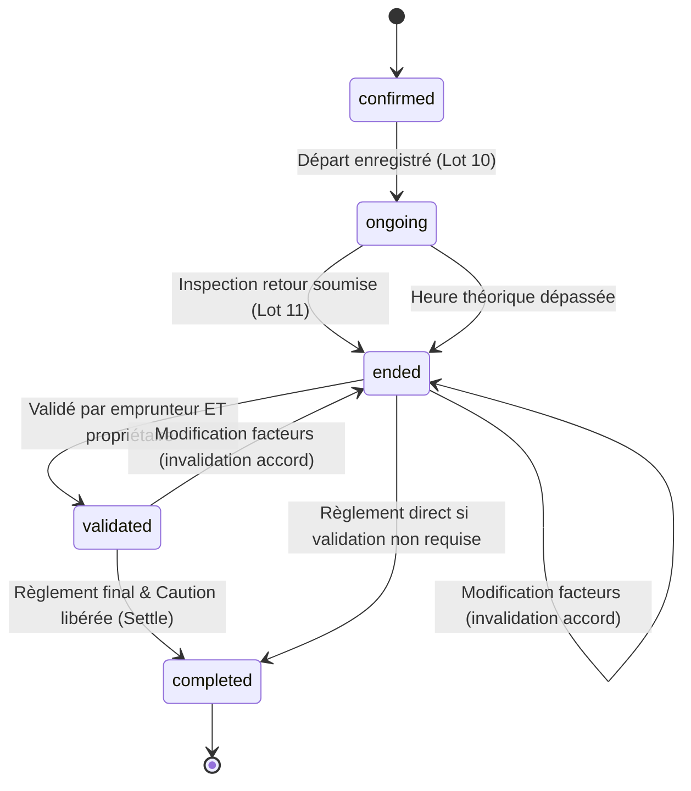

# Spécification Technique & Cadrage — Lot 11 (Retour, validation et règlement final)

Ce document formalise l'architecture, la machine à états de clôture, les contrats d'API, l'arbitrage odométrique (zéro km et incohérences), la validation contradictoire et l'invalidation d'accord, le scellement cryptographique SHA-256 des preuves, la réconciliation financière et la libération de la caution Stripe, ainsi que la stratégie de tests pour le **Lot 11** du projet LocoMotion.

---

## 1. Mission & Périmètre du Lot 11

### 1.1 Mission
Clôturer le cycle de prêt en assurant une restitution contradictoire certifiée (état des lieux retour), une estimation exacte de la contribution réelle réconciliée avec le prépaiement initial, une validation équitable entre emprunteur et propriétaire avec traçabilité d'invalidation en cas de modification, et un règlement final unique sans double débit garantissant la libération de la caution bancaire Stripe.

### 1.2 Périmètre inclus
1. **Parcours guidé de restitution & état des lieux retour** :
   - Écran mobile dédié [`loan_return_inspection_screen.dart`](file:///Users/fabapps/Documents/Dev/locomotion/mobile/lib/features/loans/presentation/screens/loan_return_inspection_screen.dart).
   - Accessible depuis [`LoanDetailScreen`](file:///Users/fabapps/Documents/Dev/locomotion/mobile/lib/features/loans/presentation/screens/loan_detail_screen.dart) pour les prêts `ongoing` ou `ended` non encore inspectés au retour.
   - Relevé kilométrique final (`odometer_km`) avec unité explicite (« KM »).
   - Jauge de batterie / carburant (`fuel_battery_level_percent`) de 0 à 100 %.
   - Évaluation de propreté intérieure/extérieure (`cleanliness_rating` de 1 à 5).
   - Checklist de retour adaptée au type de véhicule (restitution des clés, câble de recharge, antivol, véhicule verrouillé et stationné à l'emplacement convenu).
   - Déclaration de dommages nouveaux (`new_damages_declared`, `comments`, photos de dommages).
   - Photos de contrôle : face avant (`front`), arrière (`back`), côté gauche (`left_side`), côté droit (`right_side`), et compteur d'arrivée (`dashboard_odometer`). Pour véhicules non motorisés (vélo, remorque), photo générale (`front` ou `overall_view`).
   - Signature contradictoire de restitution (capture numérique horodatée avec identité du signataire).

2. **Arbitrage odométrique & cas Zéro Kilomètre** :
   - Si `odometer_km < mileage_start` : rejet immédiat avec code HTTP `422 Unprocessable Entity` ("Le kilométrage au retour ne peut pas être inférieur au kilométrage au départ.").
   - Si `odometer_km == mileage_start` (**0 km parcouru**) : **strictement autorisé** et testé côté serveur et client (ex: annulation de déplacement in extremis, intempéries ou utilisation stationnaire). Remplacement de la contrainte historique `gt` par `gte` dans `LoanController@updateFactors` et `LoanInspectionController@return`.
   - Véhicules sans compteur (`requires_mileage == false`) : kilométrage optionnel et photo compteur non exigée.

3. **Indépendance vis-à-vis du statut et retour anticipé** :
   - `POST /api/v1/loans/{loan}/inspections/return` traite de manière transparente les prêts en cours (`ongoing`) et les prêts dont l'échéance théorique est déjà dépassée (`ended`).
   - Si le prêt est en cours lors de la restitution, `actual_return_at` est atomiquement ajusté à l'horodatage courant et le statut passe à `ended`.
   - Aucun appel forcé préalable à `PUT /loans/{id}/return` (qui rejetterait en 422 si le prêt est déjà `ended`).

4. **Validation contradictoire & Invalidation d'accord** :
   - Validation par l'emprunteur (`borrower_validated_at`) et par le propriétaire / co-propriétaire (`owner_validated_at`).
   - Cas propriétaire-emprunteur (`borrowedByOwner()`) : validation conjointe automatique en une seule action.
   - Support de l'auto-validation (`autoValidate`) pour bibliothèques avec question/réponse sécurisée.
   - **Règle d'invalidation** : toute modification ultérieure des facteurs (`updateFactors` : kilométrage, frais, photos) réinitialise immédiatement `borrower_validated_at = null` et `owner_validated_at = null`, rétrogradant le statut de `validated` vers `ended`. Aucun accord n'est préservé si les chiffres changent.

5. **Signature contractuelle contradictoire & Gestion des désaccords** :
   - Signature scellée dans l'état des lieux retour (`signature` dans `meta.inspections.return`).
   - Distincte de l'action `/validate` (approbation comptable finale).
   - En cas de désaccord lors du retour (ex: dommage constaté non accepté), l'utilisateur peut déclarer un litige/incident sans être forcé de valider un montant contesté.

6. **Réconciliation financière réelle (`GET /loans/{loan}/estimate`)** :
   - Calcul côté serveur basé sur la distance réelle parcourue ($\Delta km = \text{mileage\_end} - \text{mileage\_start}$) et la durée réelle consommée.
   - Détail transparent : contribution kilométrique, contribution horaire, dépenses remboursables (`expenses_amount`), pourboire, TPS (5%) et TVQ (9.975%).
   - Comparaison avec le prépaiement déjà encaissé au Lot 9.
   - Affichage clair de l'écart : reliquat dû (si dépassement kilométrique/horaire), solde nul, ou trop-perçu.

7. **Règlement final & Clôture (`POST /loans/{loan}/settle`)** :
   - Route atomique et non réentrante `POST /api/v1/loans/{loan}/settle` protégée par verrouillage pessimiste (`lockForUpdate`).
   - Libération de l'empreinte de caution Stripe (`Stripe::cancelPaymentIntent($depositPaymentIntentId)`) avec mise à jour `deposit_status = "released"`.
   - Prélèvement du reliquat éventuel selon le modèle financier approuvé (solde utilisateur ou carte sans double débit).
   - Génération définitive des factures (`borrower_invoice`, `owner_invoice`) et transition vers `completed` avec horodatage `paid_at`.

8. **Résilience et dissociation « Restitution » / « Encaissement »** :
   - « Véhicule rendu » (`ended`) n'implique pas « paiement encaissé » (`completed`).
   - En cas d'échec de paiement (carte expirée, refus bancaire), le prêt reste en statut `ended` ou `validated` avec possibilité de reprise contrôlée.
   - Protection stricte anti-double facturation par idempotence et verrou de base de données.

### 1.3 Hors périmètre
- Capture automatique unilatérale de caution pour dommage non arbitré.
- Gestion administrative complète et expertise contradictoire d'assurance (relevant du Lot 15 — Incidents et signalements).

---

## 2. Architecture & Composants Métier

### 2.1 Backend (Laravel)

```
app/
├── Http/
│   ├── Controllers/
│   │   ├── LoanInspectionController.php   # Ajout de l'action return() & index()
│   │   ├── LoanPaymentController.php      # Ajout de l'action settle()
│   │   └── LoanController.php             # Arbitrage gte sur mileage_end & invalidation
│   └── Resources/
│       └── Loan/
│           └── LoanResource.php           # Exposition return_inspection_completed, paid_at, deposit_released_at
├── Models/
│   ├── Loan.php                           # Méthodes settle(), isReturnInspectionCompleted(), refreshStatus()
│   └── Policies/
│       ├── LoanPolicy.php                 # validateLoanInfo, pay, updateLoanInfo
│       └── ImagePolicy.php                # Autorisation photos retour
└── Services/
    ├── StripeService.php                  # cancelPaymentIntent()
    └── StripeFake.php                     # Simulation fidèle annulation caution
```

### 2.2 Mobile (Flutter / Riverpod)

```
lib/features/loans/
├── data/
│   ├── datasources/
│   │   ├── return_draft_local_data_source.dart      # Persistance locale sécurisée SharedPreferences
│   │   └── loan_inspection_remote_data_source.dart   # submitReturnInspection & settleLoan
│   └── repositories/
│       ├── return_draft_repository_impl.dart
│       └── loan_inspection_repository_impl.dart
├── domain/
│   ├── entities/
│   │   ├── loan.dart                                # Helpers returnInspectionCompleted, canReturn, canSettle
│   │   ├── return_draft.dart                        # Entité Freezed brouillon local retour
│   │   └── loan_inspection.dart                     # Entité Freezed inspection
│   └── repositories/
│       ├── return_draft_repository.dart
│       └── loan_inspection_repository.dart
└── presentation/
    ├── controllers/
    │   ├── loan_return_controller.dart              # Family Riverpod provider isolé par loanId
    │   ├── loan_settle_controller.dart              # Gestion du règlement final et clôture
    │   └── loan_inspection_providers.dart           # Injection DI
    ├── screens/
    │   ├── loan_return_inspection_screen.dart       # Écran de restitution guidé
    │   └── loan_detail_screen.dart                  # Boutons contextuels, badges d'état et reprise
    └── widgets/
        ├── return_signature_pad.dart                # Composant de signature numérique contradictoire
        └── final_reconciliation_card.dart           # Récapitulatif financier réel vs prépaiement
```

---

## 3. Contrats d'API & Sécurité

### 3.1 Soumission de l'État des Lieux Retour
* **Méthode** : `POST`
* **Route** : `/api/v1/loans/{loan}/inspections/return`
* **Policy** : `LoanPolicy@validateLoanInfo` (Emprunteur, Propriétaire, Co-propriétaire, Admin)
* **Statuts de prêt autorisés** : `ongoing`, `ended`
* **Header d'idempotence** : `Idempotency-Key: return-inspection-{loanId}-{timestamp}`

#### Request Payload
```json
{
  "odometer_km": 124585,
  "fuel_battery_level_percent": 80,
  "cleanliness_rating": 4,
  "checklist": {
    "key_returned": true,
    "charging_cable_returned": true,
    "lock_closed": true,
    "parked_at_designated_spot": true
  },
  "photos": [
    { "field": "front", "image_id": 510 },
    { "field": "back", "image_id": 511 },
    { "field": "left_side", "image_id": 512 },
    { "field": "right_side", "image_id": 513 },
    { "field": "dashboard_odometer", "image_id": 514 },
    { "field": "damage_1", "image_id": 515 }
  ],
  "new_damages_declared": true,
  "comments": "Restitution effectuée dans la cour. Légère griffure constatée sur l'aile arrière droite.",
  "signature": {
    "raw_svg_or_png_image_id": 516,
    "signer_full_name": "Fabien Emprunteur",
    "signed_at": "2026-10-01T18:00:00Z",
    "client_data_sha256": "c85a21098de742bf9e01824c32145e690a8412bc4f012e84127049adbc841029"
  }
}
```

#### Règles Métier & Arbitrage Odomètre
1. **Contrôle anti-IDOR** : Chaque identifiant dans `photos.*.image_id` et `signature.raw_svg_or_png_image_id` DOIT appartenir à l'utilisateur courant (`/images/tmp/{userId}/`). Tout identifiant étranger déclenche immédiatement un `403 Forbidden`.
2. **Arbitrage Zéro km & Cohérence** :
   - Si `odometer_km < loan.mileage_start` : rejet strict `422 Unprocessable Entity` (`"Le kilométrage au retour ne peut pas être inférieur au kilométrage au départ."`).
   - Si `odometer_km == loan.mileage_start` : **autorisé** (0 km parcouru).
   - Si véhicule non motorisé (`loanable.requires_mileage == false`) : `odometer_km` et `dashboard_odometer` sont optionnels.
3. **Transition atomique** :
   - Si le prêt était `ongoing`, le statut devient `ended`, et `actual_return_at = min(now, departure_at + duration_in_minutes)`.
   - `mileage_end` est mis à jour sur le prêt.
   - La photo de compteur `dashboard_odometer` est synchronisée avec `mileageEndImage`.
4. **Scellement SHA-256** :
   - Calcul de l'empreinte binaire SHA-256 de chaque fichier photo réel stocké.
   - Hash canonique combinant données textuelles, empreintes des images, identifiant de l'utilisateur et horodatage ISO-8601.
5. **Anti-concurrence** :
   - Si l'état des lieux de retour a déjà été validé (`meta.inspections.return.completed == true`), rejet immédiat avec `409 Conflict`.

#### Response (201 Created)
```json
{
  "data": {
    "loan_id": 42,
    "inspection_type": "return",
    "odometer_km": 124585,
    "distance_traveled_km": 85,
    "fuel_battery_level_percent": 80,
    "cleanliness_rating": 4,
    "checklist": {
      "key_returned": true,
      "charging_cable_returned": true,
      "lock_closed": true,
      "parked_at_designated_spot": true
    },
    "photos": {
      "front": "/api/v1/images/510",
      "back": "/api/v1/images/511",
      "left_side": "/api/v1/images/512",
      "right_side": "/api/v1/images/513",
      "dashboard_odometer": "/api/v1/images/514",
      "damage_1": "/api/v1/images/515"
    },
    "new_damages_declared": true,
    "comments": "Restitution effectuée dans la cour...",
    "signature": {
      "signer": "Fabien Emprunteur",
      "signed_at": "2026-10-01T18:00:00Z"
    },
    "sealed_hash": "b7842c31e09a32d184f09d21c430e84b8102fae3810294bc12984ac01248ef20",
    "created_at": "2026-10-01T18:00:02Z",
    "loan_status": "ended"
  }
}
```

---

### 3.2 Estimation de la Contribution Réelle
* **Méthode** : `GET`
* **Route** : `/api/v1/loans/{loan}/estimate`
* **Query Parameters** : `mileage_start`, `mileage_end`, `duration_in_minutes`, `expenses_amount`, `platform_tip`
* **Policy** : `LoanPolicy@view`

#### Response (200 OK)
```json
{
  "available": true,
  "blocking_loan": null,
  "desired_contribution": 0,
  "borrower_invoice": {
    "id": null,
    "total_cents": 4125,
    "total_dollars": 41.25,
    "lines": [
      { "type": "loan_distance", "description": "85 km à 0.25 $/km", "amount_cents": 2125 },
      { "type": "loan_duration", "description": "Durée 4h à 4.00 $/h", "amount_cents": 1600 },
      { "type": "tax_tps", "description": "TPS (5%)", "amount_cents": 186 },
      { "type": "tax_tvq", "description": "TVQ (9.975%)", "amount_cents": 372 }
    ]
  },
  "financial_reconciliation": {
    "prepaid_amount_cents": 3000,
    "actual_total_cents": 4125,
    "balance_due_cents": 1125,
    "deposit_status": "authorized",
    "deposit_authorized_cents": 25000
  }
}
```

---

### 3.3 Validation Contradictoire
* **Méthode** : `PUT`
* **Route** : `/api/v1/loans/{loan}/validate`
* **Policy** : `LoanPolicy@validateLoanInfo`

#### Règles
- Emprunteur valide : horodate `borrower_validated_at = now()`.
- Propriétaire valide : horodate `owner_validated_at = now()`.
- Propriétaire-emprunteur : horodate simultanément `borrower_validated_at` et `owner_validated_at`.
- Si toutes les validations requises sont présentes, le statut passe de `ended` à `validated`.
- Émission de `LoanValidatedEvent`.

---

### 3.4 Règlement Final & Clôture (Settle)
* **Méthode** : `POST`
* **Route** : `/api/v1/loans/{loan}/settle`
* **Policy** : `LoanPolicy@pay` (Emprunteur, Propriétaire ou Admin)
* **Statuts requis** : `ended` ou `validated`

#### Request Payload
```json
{
  "release_deposit": true,
  "incident_claim_cents": 0
}
```

#### Traitement sous verrou pessimiste (`lockForUpdate`)
1. **Idempotence sous verrou** : si déjà `completed` et que la caution a déjà été traitée, retour idempotent immédiat sans double opération.
2. **Re-vérification stricte des conditions métier sous verrou** :
   - Vérification que l'heure de départ est dépassée (`now() >= departure_at`).
   - Vérification de la présence des informations requises (`has_required_info_to_validate`).
   - Vérification de l'accord contradictoire : si `needs_validation && !isFullyValidated()`, rejet strict avec code `403/422` interdisant tout prélèvement non consenti.
3. **Réconciliation financière du prépaiement Stripe** :
   - Calcul du total réel définitif : `final_total_cents = round(abs(borrowerInvoice->total) * 100)`.
   - Récupération du montant prépayé : `prepaid_cents` (depuis `meta.prepaid_cents` ou `Stripe::retrievePaymentIntent`).
   - Calcul du solde net dû : `balance_due_cents = max(0, final_total_cents - prepaid_cents)`.
   - Calcul du trop-perçu éventuel : `refund_cents = max(0, prepaid_cents - final_total_cents)`.
   - Vérification de solvabilité sur le reliquat uniquement (`user->balance >= balance_due_cents / 100`), éliminant tout blocage 403 erroné.
   - Crédit du montant prépayé sur le solde utilisateur avant `pay()`, afin que la déduction intégrale opérée par `pay()` corresponde exactement au reliquat net à payer (ou laisse le trop-perçu crédité).
4. **Exécution de `$lockedLoan->pay()` & Clôture** :
   - Génération et enregistrement des factures définitives (`borrower_invoice`, `owner_invoice`).
   - Débit/crédit comptable des soldes (`addToBalance`).
   - Horodatage `paid_at = now()` et transition vers `completed`.
   - **Préservation de l'heure réelle de retour anticipé** : si un état des lieux de retour est complété (`hasReturnInspection == true`), `actual_return_at` est sanctuarisé et n'est pas écrasé par `paid_at`.
   - Persistance du relevé de réconciliation dans `meta.reconciliation`.
5. **Découplage de la libération de caution Stripe (Garantie d'atomicité)** :
   - L'appel externe `Stripe::cancelPaymentIntent` est exécuté **après le commit** de la transaction SQL. Si la transaction de base de données échoue (rollback), la caution Stripe n'est pas libérée prématurément. L'appel Stripe est idempotent.
6. Émission de l'événement `LoanPaidEvent($loan)`.

#### Response (200 OK)
```json
{
  "data": {
    "id": 42,
    "status": "completed",
    "paid_at": "2026-10-01T18:45:00Z",
    "actual_return_at": "2026-10-01T10:15:00Z",
    "deposit_status": "released",
    "deposit_released_at": "2026-10-01T18:45:00Z",
    "borrower_total": 41.25,
    "actual_distance": 85,
    "reconciliation": {
      "final_total_cents": 4125,
      "prepaid_cents": 3500,
      "balance_due_cents": 625,
      "refund_cents": 0,
      "settled_at": "2026-10-01T18:45:00Z"
    }
  }
}
```

---

## 4. Matrice d'Accès & Machine à États

### 4.1 Matrice d'Accès par Rôle

| Action | Emprunteur | Propriétaire / Co-proprio | Propriétaire-Emprunteur | Tiers / Non membre |
|---|:---:|:---:|:---:|:---:|
| **Accéder à l'écran de retour** | Oui (si prêt actif) | Oui (si prêt actif) | Oui | Non (403/Redirect) |
| **Soumettre l'état des lieux retour** | Oui | Oui | Oui | Non (403 Forbidden) |
| **Valider contradictoirement (`/validate`)** | Valide rôle emprunteur | Valide rôle propriétaire | Valide les deux rôles | Non (403 Forbidden) |
| **Consulter le dossier d'inspection scellé** | Oui | Oui | Oui | Non (403 Forbidden) |
| **Accéder aux photos d'inspection (ImagePolicy)** | Oui | Oui | Oui | Non (403 Forbidden) |
| **Régler et clôturer (`/settle`)** | Oui | Oui | Oui | Non (403 Forbidden) |

### 4.2 Machine à États du Prêt (Lot 11)



---

## 5. Gestion des Erreurs, Résilience & Reprise

### 5.1 Brouillon Local & Reprise Asynchrone
- Clé SharedPreferences isolée : `return_draft_{userId}_{loanId}`.
- Chaque photo prise est immédiatement uploadée en tâche de fond vers `POST /api/v1/images`.
- Dès qu'un `image_id` est obtenu, il est persisté dans le brouillon local.
- Si l'application est quittée ou le réseau coupé, la réouverture réhydrate les photos déjà téléversées : aucun double envoi.
- Nettoyage du brouillon (`clearDraft`) et purge des fichiers photos temporaires locaux uniquement après réception du code HTTP 201 Created du serveur.

### 5.2 Déconnexion « Véhicule Restitué » vs « Paiement Encaissé »
- Si la transaction bancaire ou la clôture finale échoue (erreur réseau, 3DS requis, carte refusée) :
  - L'état des lieux de retour reste scellé et enregistré sur le serveur (`ended` ou `validated`).
  - L'utilisateur n'a jamais à refaire l'état des lieux ni à reprendre les photos.
  - L'écran affiche un bouton « Reprendre le règlement » invitant à régulariser le paiement avec affichage explicite de l'erreur retournée par le serveur ou le réseau.

### 5.3 Invalidation d'Accord
- Si l'une des parties modifie les facteurs après validation :
  - `odometer_km` / `mileage_end` modifié $\rightarrow$ `borrower_validated_at = null`, `owner_validated_at = null`, rétrogradation du statut de `validated` à `ended`.
  - Notification aux parties prenantes.
  - Le prêt ne peut pas être clôturé sans nouvel accord formel sur les nouveaux chiffres.

---

## 6. Stratégie de Test & Matrice d'Acceptation

### 6.1 Distinction des Garanties : Prévues vs Vérifiées

> [!NOTE]
> Conformément aux exigences de rigueur technique, la matrice distingue ci-dessous les **propriétés vérifiées directement par assertions unitaires/intégration** des **garanties architecturales assurées par le socle d'infrastructure** (SGBD, API Stripe).

* **Scellement SHA-256** :
  - *Vérifié par test* : Calcul effectif et égalité stricte du digest SHA-256 (`LoanInspectionReturnTest::testReturnInspectionSealsSha256`), intégrant le tri canonique des clés, le hash binaire de chaque photo stockée, l'objet signature et l'horodatage ISO.
* **Concurrence & Idempotence `/settle`** :
  - *Vérifié par test* : Idempotence séquentielle de rejeu immédiat (`testConcurrentSettleIsIdempotent`) : une seconde requête `/settle` renvoie le prêt clôturé sans re-facturation, sans débit additionnel et sans duplication d'annulation Stripe.
  - *Garantie d'architecture* : L'exclusion mutuelle en environnement multi-processus parallèle est assurée par le verrou pessimiste PostgreSQL `lockForUpdate` (`SELECT ... FOR UPDATE`) encapsulé dans `DB::transaction`.
* **Réconciliation financière du prépaiement** :
  - *Vérifié par test* : `testSettleReconcilesStripePrepaymentWithoutDoubleChargeOr403` démontre qu'un utilisateur avec un solde inférieur au montant brut peut clôturer son prêt si son prépaiement couvre le coût, et qu'aucune double charge n'est appliquée.
* **Sanctuarisation de l'heure de retour anticipé** :
  - *Vérifié par test* : `testSettlePreservesActualReturnAtFromEarlyReturn` démontre qu'un véhicule rendu à 10 h et réglé à 18 h conserve son horodatage de restitution réel à 10 h.
* **Invalidation d'accord lors de la mise à jour kilométrique** :
  - *Vérifié par test* : `testReturnInspectionResetsStaleValidationsWhenOdometerUpdated` démontre qu'une soumission d'état des lieux avec modification d'odomètre remet à zéro les validations périmées et rétrograde le statut en `ended`.

### 6.2 Matrice Exigence $\rightarrow$ Composant $\rightarrow$ Test Automatisé

| # | Exigence | Composant / Fichier | Test Automatisé | Nature de la garantie |
|---|---|---|---|---|
| **11.1** | **Parcours retour nominal (motorisé)** : odomètre, 5 photos, checklist, signature, transition vers `ended`. | `LoanInspectionController.php`<br>`loan_return_inspection_screen.dart` | `LoanInspectionReturnTest::testNominalReturnInspectionCar`<br>`loan_return_inspection_screen_test.dart` | **Vérifiée** (End-to-end API & Widget) |
| **11.2** | **Arbitrage Zéro km autorisé** : `odometer_km == mileage_start` validé sans erreur. | `LoanInspectionController.php`<br>`LoanController.php` | `LoanInspectionReturnTest::testZeroKmReturnAllowed`<br>`LoanUpdateFactorsTest::testZeroKmUpdateFactorsAllowed` | **Vérifiée** (Validation gte) |
| **11.3** | **Rejet odomètre incohérent** : `odometer_km < mileage_start` renvoie `422`. | `LoanInspectionController.php`<br>`loan_return_controller.dart` | `LoanInspectionReturnTest::testOdometerLesserThanStartFails`<br>`loan_return_controller_test.dart` | **Vérifiée** (Validation d'intégrité) |
| **11.4** | **Exemption véhicule non motorisé** : vélo sans compteur n'exige ni `odometer_km` ni `dashboard_odometer`. | `LoanInspectionController.php`<br>`loan_return_inspection_screen.dart` | `LoanInspectionReturnTest::testBikeReturnExemption`<br>`loan_return_inspection_screen_test.dart` | **Vérifiée** (Règle métier polymorphe) |
| **11.5** | **Anti-IDOR strict sur photos et signature** : rejet `403` si une image appartient à un tiers. | `LoanInspectionController.php` | `LoanInspectionReturnTest::testAntiIdorRejectsImagesOfOtherUser` | **Vérifiée** (Sécurité & isolation utilisateurs) |
| **11.6** | **Scellement SHA-256 infalsifiable** : scellement incluant l'empreinte binaire des images de retour. | `LoanInspectionController.php` | `LoanInspectionReturnTest::testReturnInspectionSealsSha256` | **Vérifiée** (Égalité stricte digest SHA-256 canonique) |
| **11.6b**| **Persistance signature mobile** : objet `signature` transmis par Flutter scellé et enregistré dans `meta`. | `LoanInspectionController.php`<br>`loan_return_controller.dart` | `LoanInspectionReturnTest::testReturnInspectionPersistsAndSealsMobileSignature` | **Vérifiée** (Alignement payload mobile & scellement) |
| **11.7** | **Anti-écrasement / Concurrence retour** : tentative de second retour renvoie `409 Conflict`. | `LoanInspectionController.php` | `LoanInspectionReturnTest::testOverwritingReturnInspectionFails409` | **Vérifiée** (Vérification atomique anti-concurrence) |
| **11.8** | **Validation contradictoire et cas propriétaire-emprunteur** : validation bi-partie et auto-validation conjointe. | `LoanController.php` | `LoanValidationTest::testOwnerBorrowerValidation`<br>`testValidationResetOnFactorsUpdate` | **Vérifiée** (Workflow contradictoire) |
| **11.8b**| **Invalidation d'accord sur odomètre modifié** : reset des validations périmées et retour à `ended`. | `LoanInspectionController.php` | `LoanInspectionReturnTest::testReturnInspectionResetsStaleValidationsWhenOdometerUpdated` | **Vérifiée** (Révocation d'accord préalable) |
| **11.9** | **Règlement final & Libération de caution (`/settle`)** : libération Stripe de la caution et transition vers `completed`. | `LoanPaymentController.php`<br>`loan_settle_controller.dart` | `LoanInspectionReturnTest::testSettleReleasesDepositAndCompletesLoan`<br>`loan_settle_controller_test.dart` | **Vérifiée** (Clôture & libération caution) |
| **11.10**| **Idempotence du règlement** : rejeu séquentiel de `/settle` n'applique qu'un seul débit comptable. | `LoanPaymentController.php` | `LoanInspectionReturnTest::testConcurrentSettleIsIdempotent` | **Vérifiée** (Rejeu idempotent) + **Garantie d'architecture** (`lockForUpdate`) |
| **11.10b**| **Re-vérification sous verrou des conditions métier** : rejet `403` si validation contradictoire incomplète. | `LoanPaymentController.php` | `LoanInspectionReturnTest::testSettleUnderLockRejectsUnvalidatedLoanWhenValidationRequired` | **Vérifiée** (Contrôle sous verrou SQL) |
| **11.11**| **Reprise brouillon retour mobile** : rétention des photos déjà envoyées en cas d'interruption. | `return_draft_repository_impl.dart` | `return_draft_repository_test.dart` | **Vérifiée** (Persistance SharedPreferences & reprise) |
| **11.12**| **Bouton contextuel & Badges d'état** : affichage dans `LoanDetailScreen` selon rôles et statut. | `loan_detail_screen.dart` | `loan_detail_return_settle_test.dart` | **Vérifiée** (Comportement UI Flutter) |
| **11.13**| **Réconciliation prépaiement Stripe** : déduction du prépaiement sans double charge ni faux 403. | `LoanPaymentController.php`<br>`Loan.php` | `LoanInspectionReturnTest::testSettleReconcilesStripePrepaymentWithoutDoubleChargeOr403` | **Vérifiée** (Réconciliation balance & Stripe) |
| **11.14**| **Préservation heure réelle de retour anticipé** : `actual_return_at` conservé lors d'un règlement tardif. | `Loan.php`<br>`LoanPaymentController.php` | `LoanInspectionReturnTest::testSettlePreservesActualReturnAtFromEarlyReturn` | **Vérifiée** (Sanctuarisation de l'intervalle réel) |

---

## 7. Décisions d'Architecture & Arbitrages Validés

1. **Arbitrage Zéro Kilomètre** :
   - Validé : Un véhicule emprunté peut être restitué sans avoir roulé (`odometer_km == mileage_start`). La contrainte historique de validation `gt` est officiellement passée à `gte`.
2. **Découplage Restitution / Règlement & Atomicité Caution** :
   - La restitution physique scellée (`/inspections/return`) et le règlement final (`/settle`) constituent deux endpoints séparés. Le retour anticipé ne bloque pas la réconciliation financière et un échec de paiement ne bloque pas l'enregistrement de l'état des lieux.
   - La libération de la caution Stripe est découplée de la transaction de base de données : elle s'exécute après le commit SQL réussi, garantissant qu'un échec de transaction interne ne relâche jamais prématurément la caution externe.
3. **Réconciliation Serveur du Prépaiement Stripe** :
   - Le serveur réconcilie automatiquement le montant prépayé (`prepaid_cents`) avec la facture finale d'utilisation. Le solde de l'utilisateur n'est débité que du reliquat net (`balance_due_cents`), empêchant tout double prélèvement ou refus 403 erroné.
4. **Caution & Dommages non arbitrés** :
   - Aucune capture de caution unilatérale n'est exécutée sans arbitrage. Si un dommage nouveau est signalé lors du retour, la caution n'est pas auto-débitée instantanément : le dossier est consigné et orienté vers la procédure d'incident et d'arbitrage (Lot 15).
