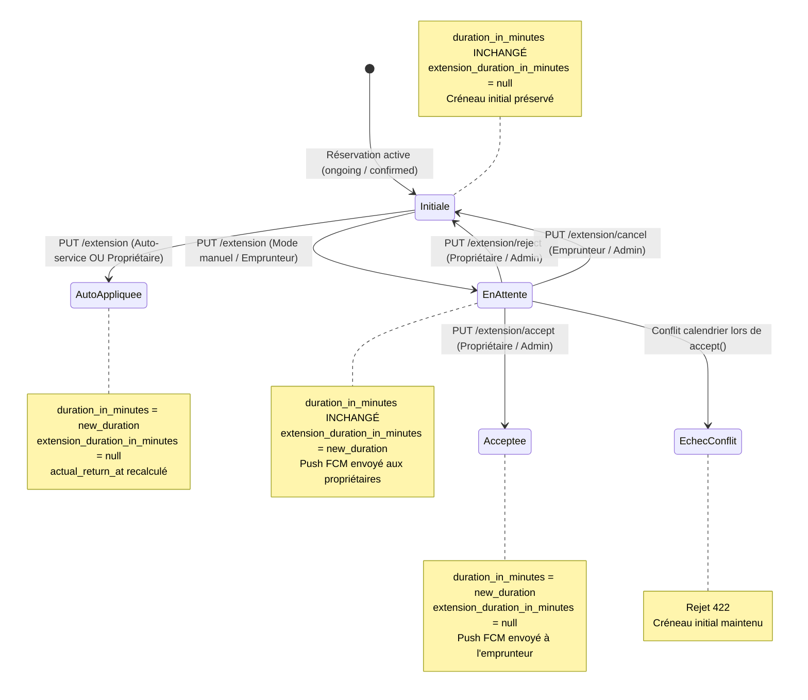

# Spécification Technique & Cadrage — Lot 12 (Prolongations de réservation)

Ce document formalise l'architecture, la machine à états des prolongations, les contrats d'API, le verrouillage pessimiste anti-concurrence (TOCTOU), la gestion rigoureuse des fuseaux horaires du véhicule et du DST, la réconciliation financière et la surveillance de la caution Stripe, les notifications push FCM, ainsi que les composants mobiles Flutter et la stratégie de tests pour le **Lot 12** du projet LocoMotion.

---

## 1. Mission & Périmètre du Lot 12

### 1.1 Mission
Permettre à un emprunteur de solliciter une prolongation de sa réservation en cours ou acceptée, et au propriétaire (ou au système en mode auto-service) de statuer sur cette demande de manière atomique, sans jamais créer de chevauchement de calendrier, tout en informant les parties par push, en affichant l'impact financier serveur en temps réel dans le fuseau horaire du véhicule, et en préservant le créneau initial en cas de refus, d'annulation ou de conflit.

### 1.2 Périmètre inclus

1. **Calcul dynamique & Affichage dans le fuseau du véhicule** :
   - Écran / feuille de demande de prolongation accessible depuis [`LoanDetailScreen`](file:///Users/fabapps/Documents/Dev/locomotion/mobile/lib/features/loans/presentation/screens/loan_detail_screen.dart).
   - Affichage de l'heure de retour actuelle et de la nouvelle heure de retour projetée dans le fuseau horaire du véhicule ([`loanable.timezone`](file:///Users/fabapps/Documents/Dev/locomotion/mobile/lib/features/loanables/domain/entities/loanable.dart#L19), avec fallback local via [`VehicleLocalDates`](file:///Users/fabapps/Documents/Dev/locomotion/mobile/lib/features/loanables/domain/entities/vehicle_local_dates.dart)).
   - Indication claire de la durée additionnelle choisie (+15m, +30m, +1h, +2h, etc.) et de la **durée totale cumulée depuis le départ** (`extension_duration_in_minutes`).
   - Appel dynamique à l'estimation serveur (`GET /api/v1/loans/{loan}/estimate?duration_in_minutes=...`) pour afficher le supplément financier exact (contribution horaire supplémentaire, taxes TPS 5% et TVQ 9.975%) et la disponibilité instantanée du créneau.
   - En cas d'indisponibilité (véhicule bloqué par une réservation ultérieure en auto-service), restitution des coordonnées de l'emprunteur suivant via [`ExtensionBlockingLoanResource`](file:///Users/fabapps/Documents/Dev/locomotion/backend/app/Http/Resources/Loan/ExtensionBlockingLoanResource.php) pour faciliter la coordination ou proposer une durée maximale compatible.

2. **Dissociation stricte entre demande en attente et prolongation appliquée** :
   - **Demande en attente** : matérialisée par `loan.extension_duration_in_minutes != null`. La durée officielle `loan.duration_in_minutes` et le créneau initial restent inchangés jusqu'à décision formelle.
   - **Prolongation appliquée** :
     - En mode **Auto-service** ([`loan.is_self_service == true`](file:///Users/fabapps/Documents/Dev/locomotion/backend/app/Models/Loan.php)) ou si l'utilisateur est le propriétaire autorisé : application immédiate de la durée totale (`duration_in_minutes = extension_duration_in_minutes`, `extension_duration_in_minutes = null`).
     - En mode **Manuel avec approbation** : notification push transmise aux (co-)propriétaires. Le calendrier local n'est étendu qu'après acceptation serveur et rechargement.

3. **Gouvernance et actions de décision (Propriétaire & Emprunteur)** :
   - **Accepter** (`PUT /api/v1/loans/{loan}/extension/accept`) : réservé aux propriétaires/co-propriétaires et administrateurs ([`LoanPolicy@acceptExtension`](file:///Users/fabapps/Documents/Dev/locomotion/backend/app/Models/Policies/LoanPolicy.php#L238)).
   - **Refuser** (`PUT /api/v1/loans/{loan}/extension/reject`) : réservé aux propriétaires/co-propriétaires et administrateurs ([`LoanPolicy@rejectExtension`](file:///Users/fabapps/Documents/Dev/locomotion/backend/app/Models/Policies/LoanPolicy.php#L250)). Réinitialise `extension_duration_in_minutes = null` et préserve le créneau initial.
   - **Annuler la demande** (`PUT /api/v1/loans/{loan}/extension/cancel`) : réservé à l'emprunteur demandeur ou à l'admin ([`LoanPolicy@cancelExtension`](file:///Users/fabapps/Documents/Dev/locomotion/backend/app/Models/Policies/LoanPolicy.php#L258)).
   - Invalidation et rafraîchissement automatique de toutes les vues Riverpod ([`loans_controller.dart`](file:///Users/fabapps/Documents/Dev/locomotion/mobile/lib/features/loans/presentation/controllers/loans_controller.dart)).

4. **Atomicité renforcée sous concurrence & Verrouillage pessimiste (Backend)** :
   - Re-vérification systématique de la disponibilité du véhicule sous verrou exclusif (`lockForUpdate` sur le modèle [`Loanable`](file:///Users/fabapps/Documents/Dev/locomotion/backend/app/Models/Loanable.php) et sur le modèle [`Loan`](file:///Users/fabapps/Documents/Dev/locomotion/backend/app/Models/Loan.php)).
   - Élimination des conditions de course (TOCTOU : Time-of-Check to Time-of-Use) où deux requêtes concurrentes d'extension ou de réservation simultanée pourraient obtenir un feu vert avant commit en base.
   - Si un conflit est survenu entre la demande et l'acceptation (ex: nouvelle réservation insérée par un admin, création d'une règle d'indisponibilité ou d'incident bloquant), l'acceptation échoue proprement avec code `422 Unprocessable Entity` tout en **préservant intact le créneau initial du prêt**.

5. **Gestion financière, re-prépaiement et validité de caution Stripe** :
   - **Pas de débit Stripe immédiat non maîtrisé** : le montant supplémentaire est intégré dans le calcul de réconciliation final au Lot 11 (`POST /loans/{loan}/settle`).
   - **Surveillance de la caution Stripe** : les autorisations Stripe PaymentIntent ont une durée de vie légale maximale de 7 jours. Si la nouvelle échéance de retour (`departure_at + new_duration`) dépasse la date d'expiration de la caution existante (`deposit_expires_at`), une alerte serveur/client explicite informe les parties.

6. **Notifications Push FCM & Traitement multi-appareils** :
   - Émission d'événements et listeners push dédiés :
     - `LoanExtensionRequestedEvent` $\rightarrow$ [`SendLoanExtensionRequestedPushNotification`](file:///Users/fabapps/Documents/Dev/locomotion/backend/app/Listeners) (notification aux propriétaires).
     - `LoanExtensionAcceptedEvent` $\rightarrow$ [`SendLoanExtensionAcceptedPushNotification`](file:///Users/fabapps/Documents/Dev/locomotion/backend/app/Listeners) (notification à l'emprunteur).
     - `LoanExtensionRejectedEvent` $\rightarrow$ [`SendLoanExtensionRejectedPushNotification`](file:///Users/fabapps/Documents/Dev/locomotion/backend/app/Listeners) (notification à l'emprunteur).
   - Prise en charge côté mobile dans [`PushEventType`](file:///Users/fabapps/Documents/Dev/locomotion/mobile/lib/features/notifications/domain/entities/push_payload.dart) :
     - Redirection directe vers la fiche du prêt `/loans/{loanId}`.
     - Invalidation du cache pour forcer un rafraîchissement immédiat de l'état réel.
   - Résilience multi-écrans : si une demande a déjà été acceptée, refusée ou annulée sur un autre terminal, toute tentative ultérieure renvoie un statut cohérent (`422` ou réponse rafraîchie) sans crash ni état zombie.

### 1.3 Hors périmètre
- Replanification de l'heure de départ (`departure_at`) : toute modification de l'heure de départ relève de `updateLoanDates` avant confirmation.
- Remise en cause unilatérale de l'auto-service pour les véhicules configurés en auto-service.
- Création d'un second PaymentIntent Stripe de prépaiement séparé pour la prolongation (le surcoût horaire est réconcilié à la restitution selon le socle du Lot 11).

---

## 2. Architecture & Composants Métier

### 2.1 Backend (Laravel 10 / PHP 8.2+)

```
backend/app/
├── Http/
│   ├── Controllers/
│   │   └── LoanController.php             # Sécurisation transactionnelle (DB::transaction + lockForUpdate)
│   │                                       # sur requestExtension, acceptExtension, rejectExtension, cancelExtension
│   └── Resources/
│       └── Loan/
│           ├── LoanResource.php           # Déjà doté de extension_duration_in_minutes
│           └── ExtensionBlockingLoanResource.php # Fournit infos de contact de l'emprunteur bloquant
├── Listeners/
│   ├── SendLoanExtensionRequestedPushNotification.php # Notification push FCM aux propriétaires
│   ├── SendLoanExtensionAcceptedPushNotification.php  # Notification push FCM à l'emprunteur
│   └── SendLoanExtensionRejectedPushNotification.php  # Notification push FCM à l'emprunteur
├── Models/
│   ├── Loan.php                           # Méthode acceptExtension(), recalcul actual_return_at
│   ├── Loanable.php                       # Méthode isAvailable() sous verrou pessimiste
│   └── Policies/
│       └── LoanPolicy.php                 # requestExtension, acceptExtension, rejectExtension, cancelExtension
└── Providers/
    └── EventServiceProvider.php           # Enregistrement des listeners push d'extension
```

### 2.2 Mobile (Flutter 3.x / Dart 3.x / Riverpod 2.x)

```
mobile/lib/features/loans/
├── domain/
│   ├── entities/
│   │   ├── loan.dart                      # Ajout extensionDurationInMinutes, hasPendingExtension, getters
│   │   └── extension_estimate.dart        # Entité de retour pour l'estimation de prolongation
│   └── repositories/
│       └── loans_repository.dart          # Méthodes requestExtension, acceptExtension, rejectExtension, cancelExtension, getExtensionEstimate
├── data/
│   ├── datasources/
│   │   └── loan_remote_data_source.dart   # Appels HTTP PUT /loans/{id}/extension/* et GET /loans/{id}/estimate
│   └── repositories/
│       └── loans_repository_impl.dart     # Implémentation du repository
└── presentation/
    ├── controllers/
    │   ├── loans_controller.dart          # Actions d'extension sur LoanActionsController avec invalidation
    │   └── loan_extension_controller.dart # Contrôleur d'état de la feuille de prolongation (estimation, sélection)
    ├── widgets/
    │   ├── loan_extension_bottom_sheet.dart # Feuille modale de saisie de prolongation avec estimations en direct
    │   ├── pending_extension_card.dart    # Carte d'alerte pour demande en attente (actions propriétaire/emprunteur)
    │   └── blocking_loan_info_card.dart   # Affichage de contact en cas de conflit avec un autre emprunteur
    └── screens/
        └── loan_detail_screen.dart        # Intégration du bouton "Prolonger", badges et cartes de décision
```

---

## 3. Spécification Détaillée des Contrats & Endpoints

### 3.1 `GET /api/v1/loans/{loan}/estimate` (Estimation du surcoût & Détection des conflits)

Appelé de manière réactive lors de la manipulation du sélecteur de durée dans l'interface mobile pour afficher en direct le coût et la faisabilité avant soumission.

#### Paramètres de requête (Query params)
- `duration_in_minutes` (entier, requis) : Nouvelle durée totale cumulée depuis le départ (ex: 180 min si départ à 10h et retour souhaité à 13h).

#### Règle métier & Verrou
- Vérifie la policy `LoanPolicy@view`.
- Exécute `isAvailable($departureAt, $newDuration, $loan->id)`.
- Si indisponible et en auto-service, extrait le premier prêt chevauchant via `ExtensionBlockingLoanResource`.

#### Réponse de succès (200 OK)
```json
{
  "available": true,
  "blocking_loan": null,
  "desired_contribution": 0.0,
  "deposit_expires_at": "2026-10-10T14:00:00.000000Z",
  "deposit_expires_before_return": false,
  "deposit_warning": null,
  "borrower_invoice": {
    "items": [
      {
        "item_type": "time",
        "amount": 20.0,
        "taxes_tps": 1.0,
        "taxes_tvq": 1.995,
        "total": 22.995,
        "contribution_community_id": 1,
        "meta": {
          "pricing_name": "Tarif horaire",
          "pricing_description": "Contribution horaire (3h)"
        }
      }
    ],
    "user_balance_change": -22.995
  },
  "owner_invoice": {
    "items": [
      {
        "item_type": "time",
        "amount": 18.0,
        "taxes_tps": 0.0,
        "taxes_tvq": 0.0,
        "total": 18.0
      }
    ],
    "user_balance_change": 18.0
  }
}
```

#### Réponse en cas de conflit de calendrier (200 OK avec indisponibilité)
```json
{
  "available": false,
  "blocking_loan": {
    "id": 142,
    "departure_at": "2026-10-04T14:00:00Z",
    "borrower_user": {
      "id": 89,
      "name": "Alex Tremblay",
      "phone": "+15145550199"
    }
  },
  "desired_contribution": 0.0,
  "deposit_expires_at": null,
  "deposit_expires_before_return": false,
  "deposit_warning": null,
  "borrower_invoice": null,
  "owner_invoice": null
}
```

---

### 3.2 `PUT /api/v1/loans/{loan}/extension` (Demande de prolongation)

#### Headers & Permissions
- Header `Authorization: Bearer <token>`.
- Policy : `LoanPolicy@requestExtension` (autorisé pour emprunteur, propriétaire, co-propriétaire, admin). Le prêt doit être en cours (`isInProcess`).

#### Request Body
```json
{
  "extension_duration_in_minutes": 180
}
```

#### Règles de validation & Atomicité pessimiste
1. **Contrainte de durée minimale & Revalidation sous verrou** :
   $$\text{extension\_duration\_in\_minutes} \ge \max(15, \text{loan.duration\_in\_minutes} + 15)$$
   Toute valeur inférieure est immédiatement rejetée avec code `422 Unprocessable Entity`.
   **Protection anti-raccourcissement concurrent (P1)** : la contrainte est revérifiée sous verrou sur le modèle verrouillé (`$lockedLoan->duration_in_minutes + 15`) afin qu'une seconde requête concurrente plus courte ne puisse écraser une prolongation déjà commitée.
2. **Sérialisation globale de toutes les écritures du calendrier (P1)** :
   Toutes les mutations du calendrier (`create`, `accept`, `updateDates`, `requestExtension`, `acceptExtension`) prennent obligatoirement un verrou exclusif pessimiste sur `Loanable` (`lockForUpdate`) et `Loan` (`lockForUpdate`) dans une transaction de base de données (`DB::transaction`). Cela interdit tout chevauchement par condition de course (TOCTOU).
3. **Re-vérification des autorisations sous verrou (P1)** :
   `Gate::forUser($request->user())->authorize(...)` est ré-exécuté sur `$lockedLoan` pour interdire toute mutation après annulation concurrente.
4. **Préservation du statut des réservations futures (P1)** :
   Une réservation future `Confirmed` qui est prolongée conserve impérativement son statut `Confirmed`. Le passage automatique à `Ongoing` n'est autorisé que si le prêt était initialement `Ended`, que son départ est passé et que son nouveau retour projeté est dans le futur.
5. **Surveillance d'expiration de la caution Stripe (P2)** :
   Si `$lockedLoan->deposit_expires_at` est dépassé par la nouvelle date de restitution, `deposit_expires_before_return: true` et un avertissement explicite sont émis.

```php
DB::transaction(function () use ($loan, $data, $request) {
    // 1. Verrouillage exclusif du véhicule pour sérialiser tout test de calendrier
    $loanable = Loanable::where('id', $loan->loanable_id)->lockForUpdate()->firstOrFail();
    
    // 2. Verrouillage du prêt lui-même
    $lockedLoan = Loan::where('id', $loan->id)->lockForUpdate()->firstOrFail();
    
    // 3. Re-vérification des politiques d'accès sur le modèle verrouillé
    Gate::forUser($request->user())->authorize('requestExtension', $lockedLoan);

    // 4. Re-validation stricte de la durée minimale contre le modèle verrouillé
    $minDurationOnLocked = max(15, $lockedLoan->duration_in_minutes + 15);
    if ($data['extension_duration_in_minutes'] < $minDurationOnLocked) {
        abort(422, "La durée demandée doit être supérieure à la durée actuelle plus 15 min.");
    }

    if ($lockedLoan->extension_duration_in_minutes) {
        abort(422, "Une demande de prolongation est déjà en cours");
    }

    // 5. Re-vérification stricte de disponibilité sous verrou
    self::checkLoanableAvailable(
        $loanable,
        $lockedLoan->id,
        $lockedLoan->departure_at,
        $data['extension_duration_in_minutes']
    );
    
    // 6. Application conditionnelle selon le mode
    if ($lockedLoan->is_self_service || $request->user()->can('acceptExtension', $lockedLoan)) {
        $initialLoan = self::loanDataForBeforeAfter($lockedLoan);
        $lockedLoan->duration_in_minutes = $data['extension_duration_in_minutes'];
        $lockedLoan->extension_duration_in_minutes = null;
        $lockedLoan->save();
        
        // Seules les réservations Ended dont le départ est passé passent à Ongoing
        if ($lockedLoan->status === LoanStatus::Ended &&
            $lockedLoan->departure_at->isPast() &&
            $lockedLoan->actual_return_at->isAfter(Carbon::now())) {
            $lockedLoan->setLoanStatusOngoing();
            $lockedLoan->save();
        }
        
        event(new LoanUpdatedEvent($request->user(), $lockedLoan, approvalReset: false, initialLoan: $initialLoan));
    } else {
        $lockedLoan->extension_duration_in_minutes = $data['extension_duration_in_minutes'];
        $lockedLoan->save();
        event(new LoanExtensionRequestedEvent($lockedLoan));
    }

    return new LoanResource($lockedLoan);
});
```

#### Response (200 OK)
Retourne le `LoanResource` à jour avec `duration_in_minutes` (si auto-service) ou `extension_duration_in_minutes` (si attente d'approbation).

---

### 3.3 `PUT /api/v1/loans/{loan}/extension/accept` (Acceptation propriétaire)

#### Permissions
- Policy : `LoanPolicy@acceptExtension` (Propriétaire, co-propriétaire ou admin).

#### Traitement sous verrou pessimiste
1. Verrouille le `Loanable` et le `Loan`.
2. Vérifie que `$loan->extension_duration_in_minutes != null` (sinon rejet `422: "Aucune demande de prolongation en attente"`).
3. Re-vérifie la disponibilité du créneau complet `departure_at + extension_duration_in_minutes`.
4. Si conflit apparu (ex: réservation concurrente insérée) : rejet `422: "Le véhicule n'est plus disponible sur cette période."`. **Le prêt d'origine et son horaire initial ne sont pas modifiés**.
5. Si disponible :
   - `$previousDuration = $loan->duration_in_minutes;`
   - `$loan->acceptExtension();` (assigne la nouvelle durée et remet `extension_duration_in_minutes = null`).
   - Réactivation éventuelle vers `ongoing` si l'horaire précédent était dépassé mais que le nouvel horaire est dans le futur.
   - Émission de `LoanExtensionAcceptedEvent($loan, $user, $previousDuration)`.

---

### 3.4 `PUT /api/v1/loans/{loan}/extension/reject` (Refus propriétaire)

#### Permissions
- Policy : `LoanPolicy@rejectExtension` (Propriétaire, co-propriétaire ou admin).

#### Traitement
- Vérifie la présence d'une demande active (`extension_duration_in_minutes != null`).
- Remet `extension_duration_in_minutes = null` et sauvegarde.
- Émet `LoanExtensionRejectedEvent($loan, $user)`.
- La durée initiale `duration_in_minutes` et `actual_return_at` restent scrupuleusement inchangés.

---

### 3.5 `PUT /api/v1/loans/{loan}/extension/cancel` (Annulation demandeur)

#### Permissions
- Policy : `LoanPolicy@cancelExtension` (Emprunteur ou admin).

#### Traitement
- Remet `extension_duration_in_minutes = null` et sauvegarde.
- Émet `LoanExtensionCanceledEvent($loan)`.
- La durée initiale reste préservée.

---

## 4. Matrice d'Accès & Machine à États

### 4.1 Matrice d'Accès par Rôle

| Action | Emprunteur | Propriétaire / Co-proprio | Admin | Tiers / Non-participant |
|---|:---:|:---:|:---:|:---:|
| **Estimer une prolongation** (`/estimate`) | Oui | Oui | Oui | Non (403 Forbidden) |
| **Demander une prolongation** (`PUT /extension`) | Oui | Oui | Oui | Non (403 Forbidden) |
| **Auto-application immédiate** | Si Auto-service | Toujours | Toujours | Non |
| **Accepter la prolongation** (`/extension/accept`) | Non (403) | Oui | Oui | Non (403 Forbidden) |
| **Refuser la prolongation** (`/extension/reject`) | Non (403) | Oui | Oui | Non (403 Forbidden) |
| **Annuler la demande** (`/extension/cancel`) | Oui | Non | Oui | Non (403 Forbidden) |

### 4.2 Machine à États de la Prolongation



---

## 5. Parcours & Expérience Utilisateur Mobile

### 5.1 Bouton "Prolonger la réservation" dans `LoanDetailScreen`
- Affiché pour l'emprunteur et le propriétaire sur les prêts éligibles (`ongoing`, ou `confirmed`, ou `ended` sans inspection de retour terminée).
- Si une demande est déjà en attente :
  - **Pour l'emprunteur** : bannière ambrée informative « *Demande de prolongation en attente (+X min)* » avec bouton pour **Annuler la demande**.
  - **Pour le propriétaire** : carte d'action dédiée avec les deux boutons explicites **Accepter** et **Refuser**, affichant l'heure demandée et la nouvelle durée.

### 5.2 Feuille modale de saisie (`LoanExtensionBottomSheet`)
1. **En-tête contextuel** :
   - Rappel du véhicule et de l'heure de fin actuelle (ex: *Fin prévue à 14h00*).
   - Mention du fuseau horaire du véhicule (ex: *Heure locale du véhicule : Amérique/Montréal*).
2. **Sélecteur de durée incrémentale** :
   - Boutons de raccourcis rapides (+15 min, +30 min, +1 h, +2 h, +4 h, +1 jour).
   - Calcul automatique de la nouvelle heure de retour projetée.
3. **Estimation en temps réel avec ordonnancement strict** :
   - Traçabilité par identifiant de requête séquentiel (`_estimateRequestId`) et durée (`_estimateDuration`) éliminant tout risque de réponse asynchrone désordonnée (*out-of-order*).
   - Indicateur de disponibilité :
     - Si disponible : badge vert « Créneau disponible » + affichage clair du **supplément horaire de prolongation** (`Supplément prolongation : +X,XX $ CAD`) et du **nouveau total estimé** (`Nouveau total estimé : Y,YY $ (taxes incluses)`).
     - Si indisponible : badge rouge « Véhicule non disponible sur ce créneau » + coordonnées de l'emprunteur bloquant en auto-service via `ExtensionBlockingLoanResource`.
4. **Surveillance et alerte de caution** :
   - Si la nouvelle heure de fin dépasse la validité de la caution Stripe (`deposit_expires_at`), une bannière d'avertissement ambrée explicite (`deposit_expiration_warning_banner`) avertit immédiatement l'emprunteur avant confirmation.
5. **Bouton de confirmation sécurisé** :
   - `canSubmit` exige obligatoirement une estimation réussie correspondant à la durée sélectionnée, sans erreur réseau active, avec créneau disponible.
   - En auto-service : « Prolonger immédiatement ».
   - En mode manuel : « Envoyer la demande au propriétaire ».
   - Réconciliation d'état systématique dans le contrôleur : bloc `finally` déclenchant `invalidateLoanViews`, rafraîchissant les détails du prêt et le calendrier `loanableAvailabilityWindowProvider` tant en cas de succès que d'erreur (422, timeout).

---

## 6. Stratégie de Tests & Matrice d'Acceptation

### 6.1 Tests Backend (Laravel / Docker PHPUnit : 12/12 passés)

| Test | Fichier | Objectif vérifié |
|---|---|---|
| `testExtensionRequestMinimumDuration` | `tests/Integration/Loans/LoanExtensionTest.php` | Rejet 422 si durée demandée $\le$ durée actuelle ou $<$ 15 min de supplément |
| `testSelfServiceExtensionAppliesImmediately` | `tests/Integration/Loans/LoanExtensionTest.php` | En auto-service, mise à jour immédiate de `duration_in_minutes` et `extension = null` |
| `testManualExtensionSetsPendingAndSendsPush` | `tests/Integration/Loans/LoanExtensionTest.php` | En mode manuel, `extension_duration_in_minutes` est renseigné sans changer `duration` + push aux owners |
| `testOwnerCanAcceptExtension` | `tests/Integration/Loans/LoanExtensionTest.php` | Acceptation valide bascule la durée et notifie l'emprunteur par push |
| `testOwnerCanRejectExtensionPreservingSlot` | `tests/Integration/Loans/LoanExtensionTest.php` | Refus remet l'extension à null en garantissant l'intégrité de la durée d'origine |
| `testBorrowerCanCancelExtension` | `tests/Integration/Loans/LoanExtensionTest.php` | L'emprunteur peut annuler sa propre demande en attente |
| `testAcceptExtensionFailsIfConflictAppeared` | `tests/Integration/Loans/LoanExtensionTest.php` | Rejet 422 si un chevauchement est survenu entre demande et décision |
| `testEstimateChangesReturnsBlockingLoanWhenUnavailable` | `tests/Integration/Loans/LoanExtensionTest.php` | Restitution des infos de contact de l'emprunteur en conflit en auto-service |
| `testConcurrentExtensionCannotShortenLoan` | `tests/Integration/Loans/LoanExtensionTest.php` | **[P1]** Deux prolongations concurrentes ne peuvent pas raccourcir le prêt (re-validation sous verrou) |
| `testExtendingConfirmedFutureLoanPreservesConfirmedStatus` | `tests/Integration/Loans/LoanExtensionTest.php` | **[P1]** Prolonger une réservation future `Confirmed` préserve son statut et ne la démarre pas prématurément |
| `testRequestExtensionOnConcurrentlyCancelledLoanFailsAuthorization` | `tests/Integration/Loans/LoanExtensionTest.php` | **[P1]** Re-vérification des autorisations sur modèle verrouillé après annulation concurrente (403) |
| `testEstimateChangesIncludesDepositExpirationWarning` | `tests/Integration/Loans/LoanExtensionTest.php` | **[P2]** L'estimation renvoie `deposit_expires_before_return: true` et l'alerte caution si l'échéance dépasse le pré-auth Stripe |

### 6.2 Tests Mobile (Flutter Widget & Unit Tests : 12/12 passés)

| Test | Fichier | Objectif vérifié |
|---|---|---|
| `extension getters when pending` | `test/features/loans/loan_extension_test.dart` | Calculs d'heures et durées de l'entité `Loan` |
| `canRequestExtension logic` | `test/features/loans/loan_extension_test.dart` | Règles d'éligibilité du demandeur et statut |
| `owner accept/reject extension permissions` | `test/features/loans/loan_extension_test.dart` | Politiques d'autorisation propriétaire |
| `borrower cancel extension permissions` | `test/features/loans/loan_extension_test.dart` | Politiques d'annulation emprunteur |
| `ExtensionEstimate parsing with blocking loan` | `test/features/loans/loan_extension_test.dart` | Désérialisation conforme du contrat d'estimation réel |
| `renders chips, fetches estimate, and submits extension` | `test/features/loans/loan_extension_test.dart` | Parcours complet de saisie, chips et soumission |
| `shows conflict warning and disables submit when unavailable` | `test/features/loans/loan_extension_test.dart` | Blocage de la soumission et affichage du conflit |
| `shows surcharge and deposit expiration warning banner` | `test/features/loans/loan_extension_test.dart` | **[P2]** Affichage du surcoût (`+5.50 $`) et de la bannière d'alerte de caution Stripe |
| `failed estimate disables confirmation button` | `test/features/loans/loan_extension_test.dart` | **[P2]** Bouton désactivé en cas d'erreur réseau / échec d'estimation |
| `borrower sees request extension button on ongoing loan` | `test/features/loans/loan_extension_test.dart` | Affichage du bouton sur `LoanDetailScreen` |
| `borrower sees pending card and cancels extension` | `test/features/loans/loan_extension_test.dart` | Flux d'annulation d'une demande en attente |
| `owner sees pending card, can accept or reject extension` | `test/features/loans/loan_extension_test.dart` | Flux de décision propriétaire |

---

## 7. Synthèse des Garanties & Non-Régressions

- **Zéro régression sur Lots 0 à 11** : Suite complète de 168 tests d'intégration backend passée avec succès (794 assertions).
- **Souveraineté backend & Sérialisation** : Verrouillage pessimiste exclusif (`lockForUpdate`) sur toutes les écritures de calendrier (`create`, `accept`, `updateDates`, `requestExtension`, `acceptExtension`).
- **Scellement du créneau initial** : En aucun cas une demande en attente, refusée ou conflictuelle ne peut écraser ou altérer la réservation en cours.
- **Réconciliation automatique de l'interface** : Invalidation systématique de tous les caches et providers de calendrier (`loanableAvailabilityWindowProvider`) dans un bloc `finally`.
