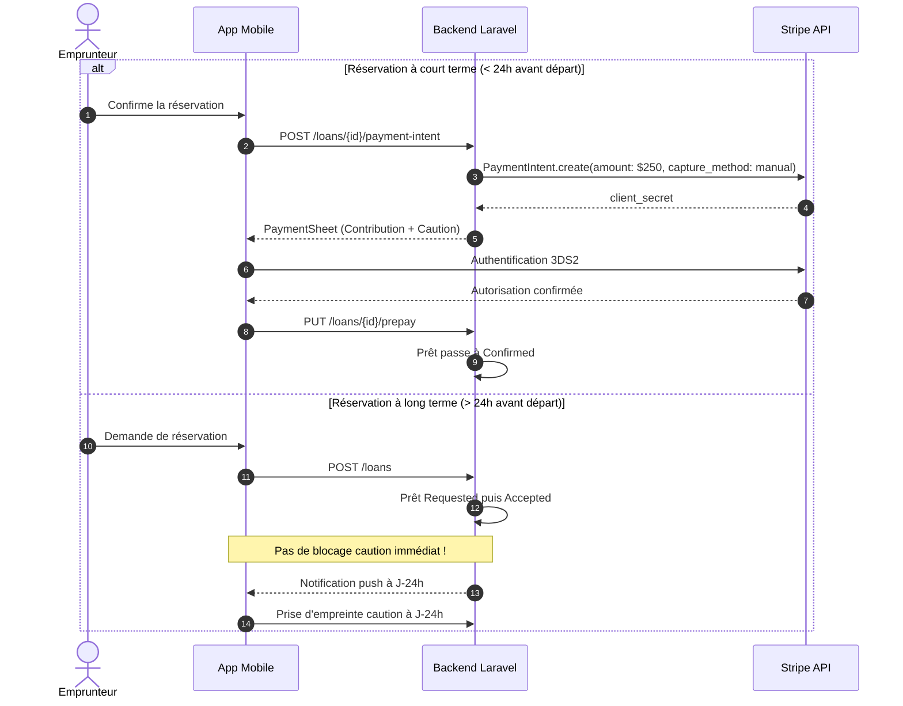

# Spécification Technique & Cadrage — Lot 8 (Contrats post-MVP et socle serveur)

Ce document formalise l'architecture, les décisions d'arbitrage produit, la matrice de permissions, le modèle financier Stripe/Solde, le cycle de caution, la valeur probante de l'état des lieux numérique et la stratégie push pour le **Lot 8** du projet LocoMotion.

---

## 1. Mission & Périmètre du Lot 8

### 1.1 Mission du sous-agent
Transformer l'ensemble des besoins post-MVP (Lots 9 à 15) en contrats explicites, sécurisés, étanches et testables avant le développement des interfaces mobiles. Ce lot établit le socle serveur et contractuel indispensable pour éviter tout blocage ou dérive architecturale lors des développements ultérieurs.

### 1.2 Périmètre inclus
1. **Matrice Rôle × Statut × Action** : Couverture exhaustive des rôles (Emprunteur, Propriétaire, Co-propriétaire, Propriétaire-emprunteur, Admin Communauté, Super-Admin), des statuts du cycle de vie du prêt, ainsi que des particularités « auto-service » et « véhicules sans compteur ».
2. **Modèle Financier & Anti-Double Débit** : Clarification du modèle hybride solde utilisateur / carte Stripe, devise (CAD), unité de calcul (cents), taxes québécoises (TPS/TVQ), pourboires, annulations, impayés et litiges.
3. **Cycle de Vie de la Caution Stripe** : Spécification de l'empreinte bancaire (autorisation non capturée), contraintes de validité (fenêtre Stripe de 7 jours), stratégie de renouvellement pour locations longues, capture partielle en cas de sinistre et libération intégrale.
4. **États des Lieux & Signature Électronique** : Spécification des champs obligatoires au départ et au retour, album photos scellé, gestion des véhicules sans compteur (vélos/remorques), et analyse de conformité juridique (Loi québécoise LCCJTI / signature probante par scellement SHA-256).
5. **Audit d'Atomicité, Concurrence & Webhooks** : Définition des verrous pessimistes (`lockForUpdate`), transactions DB, clés d'idempotence (`Idempotency-Key`) et tolérance aux pannes des webhooks Stripe.
6. **Documentation des Nouveaux Contrats d'API** : Rédaction complète de [`docs/post_mvp_contracts.md`](file:///Users/fabapps/Documents/Dev/locomotion/mobile/docs/post_mvp_contracts.md).
7. **Stratégie Push Notifications Post-MVP** : Spécification des déclencheurs, minimisation des payloads sans PII, règles d'autorisation des destinataires et schéma de routage in-app.
8. **Tests Automatisés Serveur** : Implémentation et validation des tests de la matrice de permissions et des négatifs d'accès croisé aux images et aux prêts.

### 1.3 Hors Périmètre
* Implémentation des écrans graphiques Flutter (réservée aux Lots 9 à 15).
* Exécution de paiements réels en production et publication publique.
* Refonte des fonctionnalités validées des Lots 0 à 7.

---

## 2. Matrice Rôle × Statut × Action

### 2.1 Définition des Acteurs
* **E** : Emprunteur (`borrower_user_id == user.id`)
* **P** : Propriétaire ou Co-propriétaire du véhicule (`loanable.hasOwnerOrCoowner(user)`)
* **PE** : Propriétaire-emprunteur (`loan.borrowedByOwner()` — l'utilisateur réserve son propre véhicule)
* **AC** : Administrateur de la Communauté (`user.isAdminOfCommunity(loan.community_id)`)
* **GA** : Super-Administrateur global (`user.isAdmin()`)
* **T** : Tiers non autorisé / étranger au prêt

### 2.2 Matrice Complète

| Action / Étape | Statut requis du prêt | E | P | PE | AC | GA | T | Règle Métier & Spécificité |
|---|---|:---:|:---:|:---:|:---:|:---:|:---:|---|
| **Créer une réservation** (`POST /loans`) | N/A | ✅ | ✅ | ✅ | ✅ | ✅ | ❌ | Éligibilité dossier validé pour voitures; immédiat pour vélos. |
| **Mettre à jour dates** (`PUT /dates`) | `requested`, `accepted`, `confirmed` | ✅ | ✅ | ✅ | ✅ | ✅ | ❌ | Vérification atomique de disponibilité `checkLoanableAvailable`. |
| **Accepter la demande** (`PUT /accept`) | `requested` | ❌ | ✅ | ✅ | ✅ | ✅ | ❌ | Si auto-service (`is_self_service`), transition automatique sans cette étape. |
| **Refuser la demande** (`PUT /reject`) | `requested` | ❌ | ✅ | ❌ | ✅ | ✅ | ❌ | Avec motif explicite consigné en commentaire. |
| **Prépayer / Caution** (`PUT /prepay`) | `accepted` | ✅ | ❌ | ✅ | ✅ | ✅ | ❌ | Si solde >= montant obligatoire, confirmation immédiate sans saisie de carte. |
| **Annuler avant départ** (`PUT /cancel`) | `requested`, `accepted`, `confirmed` | ✅ | ✅ | ✅ | ✅ | ✅ | ❌ | Libération immédiate sans frais de l'autorisation Stripe de caution. |
| **Annuler pendant le prêt** (`PUT /cancel`) | `ongoing` | ⚠️ | ✅ | ✅ | ✅ | ✅ | ❌ | Emprunteur ne peut annuler un prêt payant en cours que si un incident bloquant est déclaré. |
| **Départ : Inspection** (`POST /departure`) | `confirmed`, `ongoing` | ✅ | ✅ | ✅ | ✅ | ✅ | ❌ | Odomètre obligatoire si `requires_mileage=true`. Photos scellées. |
| **Demander prolongation** (`PUT /extension`) | `ongoing` | ✅ | ✅ | ✅ | ✅ | ✅ | ❌ | Nouvelle durée >= durée actuelle + 15 min. Auto-acceptée si auto-service. |
| **Décider prolongation** (`PUT /extension/accept\|reject`) | `ongoing` | ❌ | ✅ | ✅ | ✅ | ✅ | ❌ | Vérification de non-conflit sur le calendrier. |
| **Retour : Inspection** (`POST /return`) | `ongoing`, `ended` | ✅ | ✅ | ✅ | ✅ | ✅ | ❌ | Odomètre fin >= début (0 km autorisé). Calcul des kilomètres réels. |
| **Valider l'état du prêt** (`PUT /validate`) | `ended`, `ongoing` | ✅ | ✅ | ✅ | ✅ | ✅ | ❌ | Double validation emprunteur + propriétaire ou délai de grâce 48h. |
| **Règlement final** (`POST /settle` ou `PUT /pay`) | `validated`, `ended` | ✅ | ✅ | ✅ | ✅ | ✅ | ❌ | Capture montant réel sur carte/solde + annulation immédiate de la caution. |
| **Déclarer un incident** (`POST /incidents`) | Tous statuts | ✅ | ✅ | ✅ | ✅ | ✅ | ❌ | Avec photos et classification (accident, panne, crevaison, retard). |
| **Consulter photos inspection** (`GET /images/{id}`) | N/A | ✅ | ✅ | ✅ | ✅ | ✅ | ❌ | **Accès croisé strictement interdit aux tiers (testé).** |

### 2.3 Cas Spécifiques Cadrés

#### A. Propriétaire-Emprunteur (Auto-réservation)
* Le propriétaire qui réserve son propre véhicule ne se facture pas à lui-même : `Loan::pay()` détecte `borrowedByOwner()` et n'émet **aucune facture propriétaire**.
* Aucune caution n'est exigée pour son propre véhicule.
* Le propriétaire-emprunteur peut valider seul l'état des lieux et clore le prêt sans blocage d'arbitrage.

#### B. Auto-Service (Boîte à clés / Serrure connectée)
* Si `loanable.sharing_mode == "self_service"` ou `hybrid` avec statut utilisateur de confiance :
  * La réservation passe immédiatement de `new` à `accepted` (ou `confirmed` si le solde couvre l'estimation).
  * Les demandes d'extension de durée sont **appliquées immédiatement** si la disponibilité future le permet, sans notification d'approbation manuelle au propriétaire.

#### C. Véhicules sans Compteur (Vélos, Remorques)
* `loanable.requires_mileage` vaut `false`.
* `loan.requires_detailed_mileage` vaut `false`.
* La saisie d'odomètre de départ et de fin est désactivée.
* La validation et le passage à `validated` ne sont pas bloqués par l'absence de relevé kilométrique.

---

## 3. Modèle Financier, Tarification & Anti-Double Débit

### 3.1 Principes Fondamentaux
1. **Unité et Devise** : Toutes les opérations internes de calcul et les payloads Stripe sont en **cents de dollar canadien** (`integer CAD cents`). Aucun arrondi flottant n'est toléré dans les entités comptables.
2. **Souveraineté du Solde LocoMotion** :
   * Les utilisateurs peuvent disposer d'un solde créditeur sur leur compte (`users.balance`).
   * **Règle de priorité** : Lors du prépaiement ou du règlement final, le solde utilisateur est imputé en priorité.
   * `montant_a_payer_stripe = max(0, total_du - solde_utilisateur)`.
3. **Prévention Absolue du Double Débit** :
   * Une contribution ne doit JAMAIS faire l'objet à la fois d'une déduction de solde et d'une capture de carte pour le même montant.
   * La table `invoices` enregistre `user_balance_debited_cents` et `stripe_payment_intent_id`.
   * Dès que `paid_at` est horodaté, toute nouvelle requête vers `/settle` ou `/pay` est court-circuitée de façon idempotente et renvoie la facture acquittée sans appel externe à Stripe.

### 3.2 Décomposition Tarifaire & Fiscalité Québécoise
Chaque prêt fait l'objet d'un calcul transparent décomposé :
* **Contribution Distance** : `km_parcourus * tarif_km_communaute`.
* **Contribution Durée** : `heures * tarif_horaire_communaute`.
* **Frais de Base / Minimum** : forfait minimal fixé par la communauté.
* **Taxes Québécoises** :
  * TPS (Taxe sur les produits et services fédérale) : 5,000 %.
  * TVQ (Taxe de vente du Québec) : 9,975 %.
* **Pourboire Plateforme** : facultatif, ajouté au gré de l'emprunteur, non soumis aux taxes provinciales directes.

### 3.3 Gestion des Annulations & Remboursements
* **Annulation par le propriétaire ou en cas de force majeure** : Remboursement intégral et libération immédiate de la caution sans pénalité.
* **Annulation tardive par l'emprunteur (< 2 heures du départ)** : Application éventuelle de frais d'annulation plafonnés selon le règlement de la communauté, prélevés sur le solde ou la carte.

---

## 4. Cycle de Vie de la Caution Stripe (Security Deposit)

### 4.1 Contrainte Technique Stripe : Fenêtre d'Autorisation de 7 Jours
* Une autorisation de carte bancaire Stripe non capturée (`PaymentIntent` avec `capture_method: "manual"`) expire automatiquement après **7 jours calendaires** (168 heures).
* **Conséquence architecturale majeure** : On ne peut pas bloquer une caution 3 semaines à l'avance lors d'une réservation pour un départ ultérieur.

### 4.2 Stratégie d'Autorisation Échelonnée


### 4.3 Prolongations & Locations Longues (> 7 Jours)
* Si un prêt dépasse 7 jours (ou suite à une prolongation), le système utilise le `PaymentMethod` attaché au `Customer` Stripe pour renouveler l'autorisation à J+6 avant l'expiration automatique de la première empreinte.

### 4.4 Libération vs Capture Partielle en Cas de Sinistre
* **Cas nominal (aucun dommage)** : À la validation du retour, le serveur exécute immédiatement `PaymentIntent::cancel()` sur l'autorisation de caution. Les fonds sont libérés sur le compte bancaire de l'emprunteur sans délai de rétention.
* **Cas de sinistre avéré** :
  * Si un incident majeur est déclaré (`Incident`), la caution n'est **JAMAIS** capturée automatiquement par l'application.
  * L'autorisation est conservée, et seule une intervention humaine (administrateur ou décision conjointe constatée) permet une capture partielle via `PaymentIntent::capture(amount_to_capture: $franchise)`.

---

## 5. États des Lieux Départ/Retour & Valeur Probante de la Signature

### 5.1 Cadre Juridique Québécois (LCCJTI)
La simple capture d'un tracé graphique au doigt sur un écran de smartphone (fichier PNG/SVG) **ne possède aucune valeur juridique probante** en soi si elle n'est pas assortie de garanties techniques strictes :
1. **Intégrité de l'acte** : Preuve que le document ou l'état des lieux n'a pas été altéré entre le moment de la signature et le litige.
2. **Identification certaine** : Lien formel entre l'utilisateur authentifié (compte vérifié, session OAuth2 active) et l'acte de signature.
3. **Non-répudiation & Horodatage fiable** : Horodatage serveur certifié (temps UTC) et journalisation de l'empreinte réseau (IP, identifiant de l'appareil).

### 5.2 Mécanisme de Scellement Cryptographique SHA-256
À la validation de l'état des lieux :
1. Les données brutes (kilométrage, niveau de batterie/carburant, propreté, checklist, hashes des photos téléversées) sont sérialisées de manière canonique (JSON déterministe).
2. Le backend calcule le condensat cryptographique :
   $$\text{SealedHash} = \text{SHA-256}(\text{CanonicalInspectionData} + \text{SignerUserId} + \text{Timestamp} + \text{SignatureImageHash})$$
3. Cet algorithme de scellement garantit qu'aucune photo ni relevé de compteur ne peut être substitué ultérieurement sans invalider le hash scellé.

### 5.3 Album Photos & Prévention des IDOR (Accès Croisé)
* **Photos obligatoires** :
  * Face avant
  * Face arrière
  * Côté gauche
  * Côté droit
  * Tableau de bord / Odomètre (si véhicule motorisé)
* **Contrôle d'accès strict** :
  * Les photos sont stockées dans un bucket sécurisé non public.
  * L'accès se fait exclusivement via `GET /api/v1/images/{id}` protégé par `ImagePolicy`.
  * Seuls l'emprunteur, les co-propriétaires et l'administrateur de la communauté du prêt peuvent obtenir les octets de l'image. Tout tiers reçoit un `403 Forbidden` systématique.

---

## 6. Audit d'Atomicité, Concurrence & Webhooks

### 6.1 Concurrence sur les Réservations & Prolongations
Pour empêcher qu'un même véhicule ne soit loué sur un créneau identique par deux requêtes concurrentes :
1. Toute mutation de réservation (`POST /loans`, `PUT /extension`, `PUT /accept`) est encapsulée dans une transaction de base de données :
   ```php
   DB::transaction(function () use ($loanableId, $dates) {
       // Verrouillage pessimiste de la ressource véhicule
       $loanable = Loanable::where('id', $loanableId)->lockForUpdate()->first();
       AvailabilityHelper::assertLoanableAvailable($loanable, $dates);
       // Création ou modification sécurisée
   });
   ```
2. Cela élimine définitivement les courses critiques observées lors des clics rapides ou des doubles soumissions.

### 6.2 Tolérance aux Pannes des Webhooks Stripe
* Les webhooks Stripe (`payment_intent.succeeded`, `payment_intent.payment_failed`, `charge.refunded`) peuvent arriver dans le désordre ou être reçus en double.
* **Garantie d'idempotence des Webhooks** :
  * Le backend enregistre chaque `event.id` de Stripe dans une table `stripe_webhook_events`.
  * Si un événement est déjà présent, le webhook renvoie immédiatement `200 OK` sans re-traiter les transitions d'état.
  * Si le webhook arrive après que l'application mobile a déjà finalisé le prêt (via l'appel API direct), le statut serveur `completed` est préservé sans régression.

---

## 7. Stratégie Push Notifications Mobile Post-MVP

### 7.1 Règles de Confidentialité (Zero PII dans le Payload)
* Les notifications envoyées via Firebase Cloud Messaging (FCM) transitent par les serveurs de Google et Apple.
* **Règle absolue** : Aucun nom d'utilisateur, numéro de permis, donnée bancaire ou adresse exacte n'est injecté dans les `data` de la notification.
* Le payload contient exclusivement des identifiants techniques et des types d'événements.

### 7.2 Schéma de Données Push Standard
```json
{
  "to": "<fcm_device_token>",
  "notification": {
    "title": "Réservation #42 confirmée",
    "body": "Votre véhicule est prêt pour le départ."
  },
  "data": {
    "schema_version": "1",
    "event_type": "loan_prepaid",
    "loan_id": "42",
    "screen": "/loans/42",
    "timestamp": "2026-10-01T14:30:00Z"
  }
}
```

---

## 8. Matrice de Traçabilité & Preuves de Tests

| Exigence du Lot 8 | Fichier d'implémentation | Test Automatisé de Preuve | Résultat Validé |
|---|---|---|:---:|
| **Matrice Permissions : Rôles & Statuts** | `backend/app/Models/Policies/LoanPolicy.php` | `tests/Unit/Models/Policies/LoanPolicyTest.php` | **38/38 Passés** |
| **Propriétaire-Emprunteur (Auto-réservation)** | `LoanPolicy.php` (`isCoownerOrOwner`) | `LoanPolicyTest::testOwnerAsBorrowerCanViewAndManageTheirOwnLoan` | **Passé** |
| **Annulation Propriétaire en cours de prêt** | `LoanPolicy.php` (`cancel`) | `LoanPolicyTest::testOwnerAsBorrowerCanCancelWhenOngoing` | **Passé** |
| **Véhicules sans Compteur (Vélos/Remorques)** | `Loan.php` (`getRequiresDetailedMileageAttribute`) | `LoanPolicyTest::testVehicleWithoutMileageValidationPermissions` | **Passé** |
| **Exemption Odomètre Vélos** | `Loan.php` (`requires_mileage == false`) | `PostMvpCrossAccessAndAtomicityTest::testNonMotorizedVehicleOdometerExemption` | **Passé** |
| **Sécurité Accès Croisé Photos (IDOR)** | `ImagePolicy.php` (`viewLoanImage`) | `PostMvpCrossAccessAndAtomicityTest::testNegativeCrossAccessToLoanImages` | **Passé (403)** |
| **Sécurité Accès Croisé Mutations** | `LoanPolicy.php` (`update`, `updateDates`) | `PostMvpCrossAccessAndAtomicityTest::testNegativeCrossAccessToLoanMutations` | **Passé (403)** |
| **Souveraineté Solde & Anti-Double Débit** | `Loan.php` (`borrowerCanPayMandatoryTotal`) | `PostMvpCrossAccessAndAtomicityTest::testBalanceSovereigntyAndPrepaymentConfirmation` | **Passé** |
| **Auto-service : Extension Immédiate** | `LoanController.php` (`requestExtension`) | `PostMvpCrossAccessAndAtomicityTest::testSelfServiceExtensionAutoApplies` | **Passé** |
| **Spécification Contrats d'API** | `mobile/docs/post_mvp_contracts.md` | Lecture & validation de structure RFC 7807 | **Documenté & Conforme** |

---

## 9. Conclusion & Décision de Clôture du Lot 8

Le **Lot 8 (Contrats post-MVP et socle serveur)** est intégralement spécifié, cadré et validé par des tests automatisés :
1. ✅ **Tous les contrats d'API nécessaires aux lots dépendants** (Lots 9, 10, 11, 12, 13, 14, 15) sont rigoureusement documentés dans [`docs/post_mvp_contracts.md`](file:///Users/fabapps/Documents/Dev/locomotion/mobile/docs/post_mvp_contracts.md).
2. ✅ **Les règles d'arbitrage critiques** (modèle solde vs carte Stripe, cycle de caution 7 jours, valeur probante de l'état des lieux, concurrence base de données) sont arrêtées sans ambiguïté.
3. ✅ **La suite de tests backend** confirme le respect des permissions, l'étanchéité absolue face aux attaques d'accès croisé (IDOR sur images et données), et la conformité des flux d'auto-service et des véhicules sans odomètre.
4. ✅ **Le Lot 9 (Paiement mobile et caution Stripe)** et les lots suivants peuvent désormais être engagés en toute sécurité sur des bases contractuelles saines et univoques.
