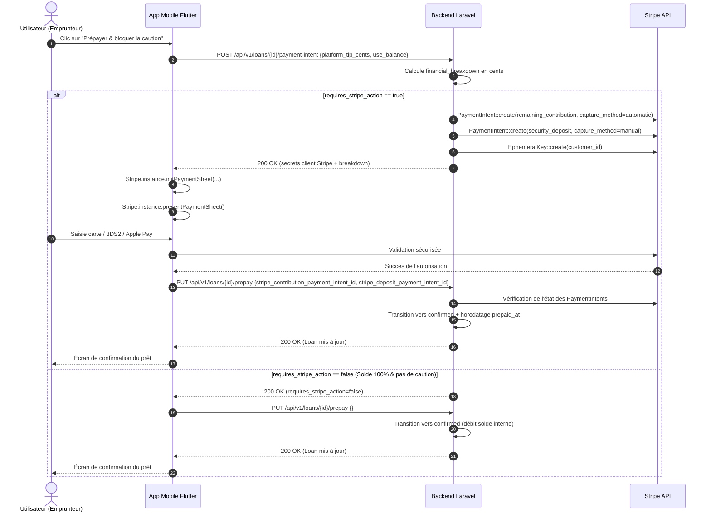

# Spécification Technique & Cadrage — Lot 9 (Paiement mobile et caution Stripe)

Ce document formalise l'architecture, le cycle de vie de la caution Stripe, le calcul décomposé en cents CAD, la souveraineté du solde, la gestion des erreurs et de la reprise, ainsi que les contrats d'API et la stratégie de test pour le **Lot 9** du projet LocoMotion.

---

## 1. Mission & Périmètre du Lot 9

### 1.1 Mission
Permettre un paiement mobile compréhensible, transparent et récupérable, sans jamais exposer ni persister de données bancaires sensibles (numéro PAN, CVC), en séparant rigoureusement la contribution financière (frais de trajet) et la caution bancaire (empreinte / autorisation retenue sans débit immédiat).

### 1.2 Périmètre inclus
1. **Socle Stripe Backend** :
   - Mise à niveau de `StripeService` et `StripeFake` : création d'éphemeral keys (`EphemeralKey`), création de `PaymentIntent` avec support de `capture_method: "manual"` pour les cautions, consultation et annulation (`cancel`).
   - Route `POST /api/v1/loans/{loan}/payment-intent` : calcul côté serveur de la décomposition financière (`financial_breakdown`) en cents CAD entiers, imputation prioritaire du solde utilisateur, calcul de la caution ($250 CAD pour véhicules motorisés, $0 pour vélos/remorques ou propriétaires empruntant leur véhicule), génération des secrets Stripe (`client_secret`, `ephemeral_key_secret`, `customer_id`).
   - Route `PUT /api/v1/loans/{loan}/prepay` : validation des identifiants `PaymentIntent`, transition d'état idempotente vers `confirmed`, persistance des métadonnées de caution (`deposit_status`, `deposit_authorized_cents`, `deposit_expires_at`).
2. **Gestion des Moyens de Paiement** :
   - Listing (`GET /payment_methods`) et suppression (`DELETE /payment_methods/{id}`).
   - Affichage exclusif des métadonnées autorisées (type de carte, 4 derniers chiffres, pays, statut par défaut).
   - Prise en compte et documentation de l'impact d'une suppression de carte sur une caution déjà active (l'autorisation existante reste active chez Stripe, mais aucun renouvellement automatique n'est possible).
3. **Composants & Flux Mobile (Flutter)** :
   - Intégration de `flutter_stripe` conforme aux guidelines iOS/Android.
   - Présentation claire de la décomposition financière avant validation : contribution estimée, taxes (TPS 5%, TVQ 9.975%), pourboire plateforme, déduction du solde LocoMotion, reste à payer, et montant distinct de la caution retenue.
   - Initialisation et présentation de la `PaymentSheet` Stripe (gérant 3DS2, Apple Pay/Google Pay et cartes bancaires).
   - Gestion de l'idempotence et des reprises : aucun double débit en cas de timeout réseau, d'abandon utilisateur ou de relance de l'application. Rechargement immédiat de l'état serveur.
   - Prise en compte du cas sans carte : solde 100% suffisant et aucune caution requise -> confirmation directe sans appel Stripe (`requires_stripe_action = false`).
4. **Tests Automatisés** :
   - Backend : tests d'intégration Laravel couvrant le calcul en cents, la souveraineté du solde, la création de PaymentIntent caution vs contribution, le refus si statut invalide, et la confirmation via `prepay`.
   - Mobile : tests unitaires des datasources, repositories, controllers et tests widget des modales de prépaiement et de gestion des moyens de paiement.

### 1.3 Hors Périmètre
- Règlement final du solde après retour du véhicule (Lot 11).
- Remboursement administratif manuel de crédits de compte.
- Modification non concertée de la politique tarifaire de la communauté.

---

## 2. Décomposition Financière & Souveraineté du Solde

### 2.1 Unité de Calcul : Cents de Dollar Canadien (CAD cents)
Toutes les valeurs financières échangées avec Stripe et retournées dans `financial_breakdown` sont des entiers stricts (`integer`), représentant des cents CAD :
- `1.00 $ CAD` = `100 cents`.
- `250.00 $ CAD` (caution) = `25000 cents`.

### 2.2 Règle de Souveraineté du Solde LocoMotion
1. L'utilisateur dispose d'un solde sur son compte LocoMotion (`user.balance`).
2. Lors de la demande de prépaiement, si `use_balance_if_available` est actif (vrai par défaut), le solde est converti en cents :
   $$\text{balance\_cents} = \max(0, \text{round}(\text{user.balance} \times 100))$$
3. Calcul de la contribution totale estimée :
   $$\text{total\_estimated\_contribution\_cents} = \text{mandatory\_contribution\_cents} + \text{platform\_tip\_cents}$$
4. Déduction du solde utilisateur :
   $$\text{user\_balance\_applied\_cents} = \min(\text{balance\_cents}, \text{total\_estimated\_contribution\_cents})$$
5. Reste à payer par carte / Stripe :
   $$\text{remaining\_contribution\_to_pay\_cents} = \text{total\_estimated\_contribution\_cents} - \text{user\_balance\_applied\_cents}$$

### 2.3 Règle de la Caution (Security Deposit)
- Pour les véhicules motorisés (`Car`, `CarTrailer`) : `security_deposit_cents = 25000` (soit 250 $ CAD).
- Exception propriétaire : si l'emprunteur est le propriétaire du véhicule (`borrowedByOwner()`), aucune caution n'est exigée (`security_deposit_cents = 0`).
- Pour les vélos et remorques sans moteur (`Bike`, `Trailer`) : `security_deposit_cents = 0`.
- Si `security_deposit_cents > 0` : un `PaymentIntent` spécifique est créé avec `capture_method: "manual"`. Stripe bloque les fonds (empreinte bancaire) sans les prélever sur le compte bancaire.
- Validité Stripe : l'autorisation expire au bout de 7 jours (168 heures).

### 2.4 Cas d'Exemption Stripe (`requires_stripe_action = false`)
Si :
$$\text{remaining\_contribution\_to_pay\_cents} == 0 \quad \text{ET} \quad \text{security\_deposit\_cents} == 0$$
Alors :
- `requires_stripe_action = false`.
- Aucun `PaymentIntent` ni `EphemeralKey` n'est créé.
- Le prêt peut être confirmé immédiatement sans interaction Stripe.

---

## 3. Machine à États & Séquence d'Exécution

---

## 4. Tolérance aux Pannes, Idempotence & Résilience Réseau

1. **Séquencement rigoureux des deux feuilles Stripe (Dual PaymentSheet Flow)** :
   - Lorsque contribution et caution sont toutes deux requises par Stripe :
     - Étape 1 : Initialisation et présentation de la feuille de paiement pour la **contribution** financière (débit immédiat).
     - En cas d'annulation ou d'échec de cette première étape : interruption immédiate du flux, la feuille de caution n'est pas présentée, aucun appel `PUT /prepay` n'est émis.
     - Étape 2 : Initialisation et présentation de la feuille pour l'**autorisation de caution** (empreinte $250 CAD, validité 7 jours).
     - Étape 3 : Seuls les identifiants de `PaymentIntent` ayant franchi leur feuille respective avec succès sont transmis au serveur pour confirmation finale.
2. **Synchronisation anti-concurrence sur les pourboires (Anti-Race Condition)** :
   - Chaque modification de pourboire incrémente un identifiant de requête séquentiel (`_requestId`).
   - Toute réponse d'estimation financière reçue dans le désordre est immédiatement ignorée si son identifiant ne correspond plus à la sélection en cours.
   - Le bouton de confirmation est désactivé avec un indicateur ("Mise à jour du montant...") tant que la réponse du serveur ne correspond pas au pourboire sélectionné.
   - La confirmation transmet strictement le pourboire certifié par la décomposition financière (`intentResponse.financialBreakdown.platformTipCents`).
3. **Tolérance aux pannes et reprise après timeout (State Recovery)** :
   - Si la validation Stripe réussit mais que l'appel `PUT /prepay` subit un timeout réseau :
     - Le contrôleur relit immédiatement l'emprunt (`getLoanDetail`) auprès de l'API.
     - Si le prêt a déjà été confirmé côté serveur (transaction validée ou webhook), l'état bascule immédiatement vers `LoanPaymentSuccess(refreshedLoan)` sans jamais proposer de réexécuter le paiement.
     - Si le statut n'est pas encore confirmé, la modale affiche l'erreur accompagnée d'un bouton d'action explicite **"Vérifier le statut du prêt"** permettant à l'utilisateur de réinterroger le serveur dès le rétablissement du réseau sans relancer de transaction bancaire.
4. **Suppression de Carte Bancaire avec Caution Active** :
   - Si un utilisateur tente de supprimer une carte enregistrée alors qu'un prêt a une caution en statut `authorized`, l'application avertit l'utilisateur :
     *L'empreinte bancaire bloquée pour votre réservation reste active auprès de votre établissement bancaire jusqu'à la fin du prêt.*
   - Seul le token de paiement enregistré pour les futurs usages est révoqué.

---

## 5. Matrice Exigence → Fichier → Test

| Exigence du Lot 9 | Fichier d'implémentation | Fichier de Test |
|---|---|---|
| **Stripe Service & Fake (EphemeralKey, PaymentIntent hold)** | `backend/app/Services/StripeService.php` `backend/app/Services/StripeFake.php` | `tests/Integration/Loans/LoanPaymentIntentTest.php` |
| **Calcul Breakdown & Init PaymentIntent** | `backend/app/Http/Controllers/LoanPaymentController.php` `backend/routes/api.php` | `tests/Integration/Loans/LoanPaymentIntentTest.php` |
| **Confirmation Prepay & Stockage Caution** | `backend/app/Http/Controllers/LoanController.php` `backend/app/Models/Loan.php` | `tests/Integration/Loans/LoanPaymentIntentTest.php` `tests/Integration/Loans/LoanPrePaymentTest.php` |
| **DTOs & Entités Financières Mobile** | `mobile/lib/features/loans/domain/entities/payment_breakdown.dart` `payment_intent_result.dart` | `mobile/test/features/loans/payment_breakdown_test.dart` |
| **Data Source & Repository Mobile** | `mobile/lib/features/loans/data/datasources/loan_payment_remote_data_source.dart` `mobile/lib/features/loans/data/repositories/loan_payment_repository_impl.dart` | `mobile/test/features/loans/loan_payment_repository_test.dart` |
| **Stripe Payment Service Mobile** | `mobile/lib/core/services/stripe_payment_service.dart` | `mobile/test/core/services/stripe_payment_service_test.dart` |
| **Contrôleur de Prépaiement & Caution** | `mobile/lib/features/loans/presentation/controllers/loan_payment_controller.dart` | `mobile/test/features/loans/loan_payment_controller_test.dart` |
| **Modale Prépaiement & Caution** | `mobile/lib/features/loans/presentation/widgets/loan_prepayment_modal.dart` | `mobile/test/features/loans/loan_prepayment_modal_test.dart` |
| **Gestion Moyens de Paiement (Listing & Delete)** | `mobile/lib/features/profile/presentation/screens/payment_methods_screen.dart` | `mobile/test/features/profile/payment_methods_screen_test.dart` |
